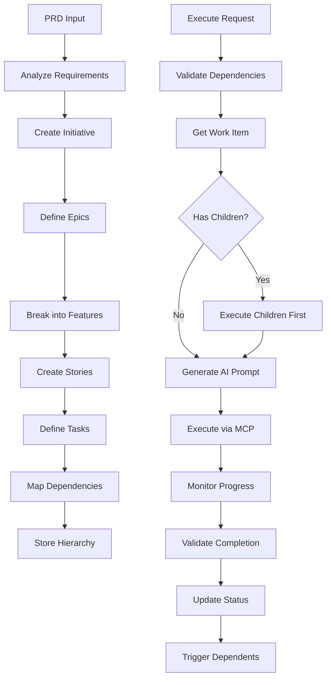

# Agile Workflow Engine

**Status**: 📋 DRAFT | **Priority**: High | **Last Updated**: 2024-12-19
**Team**: AI Development | **Progress**: 0% | **Target Release**: Phase 1.2 - February 2025
**Dependencies**: 1 Blocking | 1 Related

## Status History

| Date       | Status   | Updated By       | Notes                                        |
| ---------- | -------- | ---------------- | -------------------------------------------- |
| 2024-12-19 | 📋 DRAFT | Solo Requirement | Initial PRD creation from main decomposition |

## 1. Product Overview

The Agile Workflow Engine manages the complete hierarchy of Initiative→Epic→Feature→Story→Task relationships and provides autonomous execution capabilities for AI agents to work through complex development workflows.

This component enables AI agents to understand project structure, track dependencies, and execute work items in the correct order while maintaining progress visibility and validation checkpoints.

## 2. Core Features

### 2.1 User Roles

| Role            | Registration Method   | Core Permissions                                          |
| --------------- | --------------------- | --------------------------------------------------------- |
| AI Agent        | MCP Client connection | Execute workflows, update progress, access task hierarchy |
| Project Manager | Configuration access  | Create workflows, set priorities, monitor progress        |
| Developer       | System access         | Review progress, validate completions, modify workflows   |

### 2.2 Feature Module

Our Agile Workflow Engine consists of:

1. **Hierarchy Manager**: Initiative/Epic/Feature/Story/Task creation and relationships
2. **Dependency Engine**: Dependency tracking, blocking relationships, execution ordering
3. **Autonomous Executor**: Sequential task execution, validation, progress tracking
4. **Progress Calculator**: Completion percentages, milestone tracking, status aggregation
5. **Validation System**: Completion verification, quality gates, acceptance criteria
6. **Workflow Orchestrator**: Multi-agent coordination, resource allocation, conflict resolution

### 2.3 Page Details

| Page Name             | Module Name             | Feature description                                                               |
| --------------------- | ----------------------- | --------------------------------------------------------------------------------- |
| Hierarchy Manager     | Work Item Creation      | Create Initiative, Epic, Feature, Story, Task objects with metadata               |
| Hierarchy Manager     | Relationship Mapping    | Establish parent-child relationships, maintain hierarchy integrity                |
| Hierarchy Manager     | Metadata Management     | Store descriptions, acceptance criteria, effort estimates, priorities             |
| Dependency Engine     | Dependency Tracking     | Map blocking relationships between work items, detect circular dependencies       |
| Dependency Engine     | Execution Ordering      | Calculate optimal execution sequence, handle parallel execution opportunities     |
| Dependency Engine     | Constraint Validation   | Verify dependency constraints before execution, prevent invalid state transitions |
| Autonomous Executor   | Task Execution          | Execute individual tasks through AI agent prompts, monitor execution status       |
| Autonomous Executor   | Sequential Processing   | Process Epic→Feature→Story→Task in dependency order                               |
| Autonomous Executor   | Error Handling          | Handle execution failures, retry logic, escalation procedures                     |
| Progress Calculator   | Completion Tracking     | Calculate completion percentages at all hierarchy levels                          |
| Progress Calculator   | Milestone Detection     | Identify and report milestone achievements, critical path updates                 |
| Progress Calculator   | Status Aggregation      | Roll up status from child items to parent items                                   |
| Validation System     | Completion Verification | Verify task completion against acceptance criteria                                |
| Validation System     | Quality Gates           | Implement quality checkpoints, automated testing integration                      |
| Validation System     | Acceptance Criteria     | Manage and validate acceptance criteria for each work item                        |
| Workflow Orchestrator | Agent Coordination      | Coordinate multiple AI agents working on different tasks                          |
| Workflow Orchestrator | Resource Management     | Allocate tasks to available agents, manage execution queues                       |
| Workflow Orchestrator | Conflict Resolution     | Handle conflicts when multiple agents modify same work items                      |

## 3. Core Process

### PRD Decomposition Flow

1. Receive PRD document input
2. AI agent analyzes requirements and scope
3. Create top-level Initiative with strategic objectives
4. Break down Initiative into Epic-level deliverables
5. Decompose each Epic into Feature components
6. Create Stories with user value statements
7. Define Tasks with specific implementation steps
8. Establish dependencies and relationships
9. Calculate initial effort estimates and priorities
10. Store complete hierarchy in database

### Autonomous Execution Flow

1. Receive execution request for work item (Epic, Feature, Story, or Task)
2. Validate all dependencies are satisfied
3. Retrieve work item details and acceptance criteria
4. If work item has children, execute children first
5. Generate AI agent prompt with context and requirements
6. Execute work item through MCP client tools
7. Monitor execution progress and handle errors
8. Validate completion against acceptance criteria
9. Update progress and trigger dependent work items
10. Report completion status and metrics

### Progress Tracking Flow

1. Monitor all active work items continuously
2. Calculate completion percentages based on child item status
3. Detect milestone achievements and critical path changes
4. Update parent item status when children complete
5. Generate progress reports and notifications
6. Identify and escalate blocked or delayed items



## 4. MCP Workflow Engine API

### 4.1 MCP Tools Specification

**Hierarchy Management Tools:**
* `create_work_item` - Create new work items in hierarchy
* `update_work_item` - Modify existing work item properties
* `delete_work_item` - Remove work items and handle dependencies
* `get_work_item_hierarchy` - Retrieve hierarchical structure
* `reorder_work_items` - Adjust work item priorities and ordering

**Dependency Management Tools:**
* `add_dependency` - Create dependency relationships
* `remove_dependency` - Remove dependency links
* `validate_dependencies` - Check for circular dependencies
* `get_dependency_graph` - Retrieve complete dependency structure
* `calculate_critical_path` - Identify critical execution path

**Execution Control Tools:**
* `execute_work_item` - Start autonomous execution of work item
* `pause_execution` - Temporarily halt work item execution
* `resume_execution` - Continue paused work item execution
* `cancel_execution` - Stop and rollback work item execution
* `get_execution_status` - Monitor real-time execution progress

**Progress Tracking Tools:**
* `calculate_progress` - Compute completion percentages
* `get_milestone_status` - Check milestone achievements
* `update_work_item_status` - Modify work item completion status
* `generate_progress_report` - Create detailed progress summaries

### 4.2 Data Exchange Formats

**Work Item Structure:**
```json
{
  "id": "string",
  "type": "Initiative|Epic|Feature|Story|Task",
  "title": "string",
  "description": "string",
  "status": "not_started|in_progress|blocked|completed|validated",
  "priority": "low|medium|high|critical",
  "effort_estimate": "number",
  "acceptance_criteria": ["string"],
  "parent_id": "string|null",
  "children_ids": ["string"],
  "dependencies": ["string"],
  "assigned_agent": "string|null",
  "metadata": {"key": "value"}
}
```

**Execution Result Format:**
```json
{
  "execution_id": "string",
  "work_item_id": "string",
  "status": "running|completed|failed|cancelled",
  "progress_percentage": "number",
  "start_time": "datetime",
  "end_time": "datetime|null",
  "error_message": "string|null",
  "artifacts_generated": ["string"],
  "validation_results": {"criteria": "boolean"}
}
```

## Architecture Considerations

### Referenced Architecture Documents

* **MCP\_SERVER\_CORE\_INFRASTRUCTURE\_PRD**: Database and server foundation - Status: 📋 DRAFT

* Will create workflow engine architecture patterns

### Quality Attributes Alignment

| Attribute       | Strategy                                            | Architecture Doc Reference   |
| --------------- | --------------------------------------------------- | ---------------------------- |
| Scalability     | Hierarchical data structure, efficient querying     | TBD - Workflow patterns      |
| Performance     | Optimized dependency resolution, parallel execution | TBD - Performance guidelines |
| Security        | Secure execution context, validation controls       | TBD - Security framework     |
| Reliability     | Robust error handling, state recovery               | TBD - Reliability patterns   |
| Maintainability | Clear separation of workflow concerns               | TBD - Code standards         |

### Architecture Validation Checkpoints

* [ ] Hierarchy data model supports all agile work item types

* [ ] Dependency engine prevents circular dependencies

* [ ] Execution engine handles concurrent agent operations

* [ ] Progress calculation scales with large hierarchies

* [ ] Validation system integrates with external tools

## Related PRDs

### Dependencies (Blocking)

* **MCP\_SERVER\_CORE\_INFRASTRUCTURE\_PRD**: Requires database and server foundation - Status: 📋 DRAFT

### Related (Non-blocking)

* **MCP\_JIVE\_AUTONOMOUS\_AI\_BUILDER\_PRD**: Parent PRD - Status: 📋 DRAFT

### Dependents (Blocked by this PRD)

* **MCP\_CLIENT\_TOOLS\_PRD**: Requires workflow execution capabilities - Status: Planned

* **TASK\_STORAGE\_SYNC\_SYSTEM\_PRD**: Requires hierarchy data model - Status: Planned

## Technical Requirements

### Core Dependencies

* **Database**: Weaviate vector database for hierarchy storage

* **Graph Processing**: NetworkX for dependency analysis

* **State Management**: Finite state machine for work item status

* **Async Processing**: asyncio for concurrent execution

* **Validation**: Pydantic for data validation

### Data Models

```python
# Work Item Hierarchy
class WorkItem:
    id: str
    type: WorkItemType  # Initiative, Epic, Feature, Story, Task
    title: str
    description: str
    status: WorkItemStatus
    priority: Priority
    effort_estimate: int
    acceptance_criteria: List[str]
    parent_id: Optional[str]
    children_ids: List[str]
    dependencies: List[str]
    assigned_agent: Optional[str]
    created_at: datetime
    updated_at: datetime
    completed_at: Optional[datetime]

class WorkItemStatus(Enum):
    NOT_STARTED = "not_started"
    IN_PROGRESS = "in_progress"
    BLOCKED = "blocked"
    COMPLETED = "completed"
    VALIDATED = "validated"
```

### Execution Engine

```python
class ExecutionEngine:
    async def execute_work_item(self, work_item_id: str) -> ExecutionResult
    async def validate_dependencies(self, work_item_id: str) -> bool
    async def calculate_execution_order(self, work_item_id: str) -> List[str]
    async def monitor_execution(self, execution_id: str) -> ExecutionStatus
    async def handle_execution_error(self, execution_id: str, error: Exception)
```

### Performance Requirements

* Hierarchy query response: <50ms for 1000+ work items

* Dependency resolution: <100ms for complex graphs

* Execution startup: <2 seconds per work item

* Progress calculation: <10ms for hierarchy updates

* Concurrent executions: 5+ parallel work items

### Validation Requirements

* Circular dependency detection

* Acceptance criteria validation

* State transition validation

* Data integrity checks

* Execution result verification

