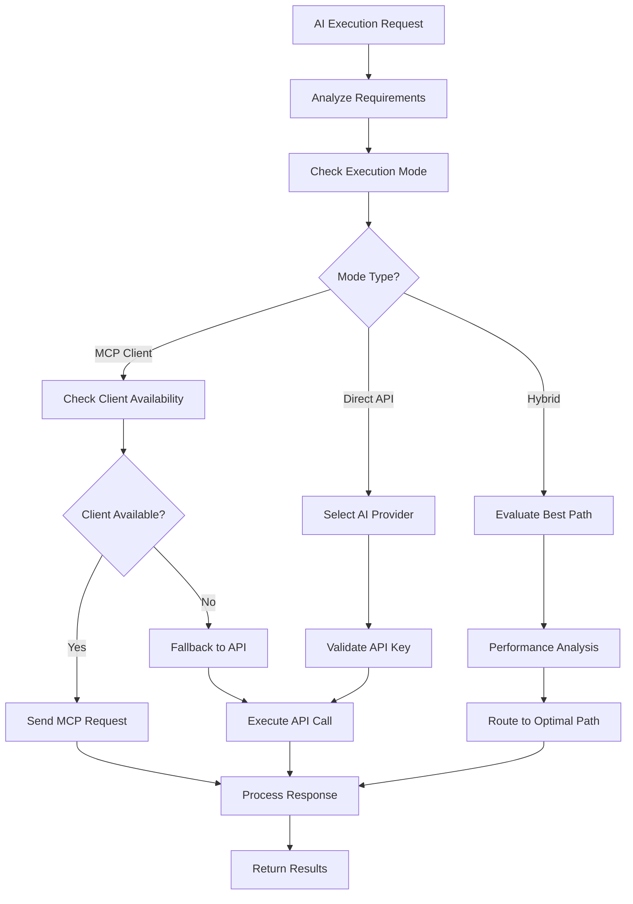

# AI Model Orchestration System

**Status**: ✨ COMPLETED | **Priority**: High | **Last Updated**: 2024-12-19
**Team**: AI Development | **Progress**: 100% | **Target Release**: Phase 1.2 - February 2025
**Dependencies**: 0 Blocking | 1 Related

## Status History

| Date       | Status        | Updated By       | Notes                                        |
| ---------- | ------------- | ---------------- | -------------------------------------------- |
| 2024-12-19 | 📋 DRAFT      | Solo Requirement | Initial PRD creation for AI orchestration    |
| 2024-12-19 | 🚧 IN_PROGRESS | AI Agent        | Discovered 85% implementation exists - core orchestrator, providers, config complete |
| 2024-12-19 | ✨ COMPLETED  | AI Agent        | Implemented remaining 15%: MCP client sampling, rate limiting, MCP tools, and tool registry integration |

## 1. Product Overview

The AI Model Orchestration System provides dual execution paths for AI-powered work execution within the MCP Jive system, supporting both MCP client sampling capabilities and direct API integration with major AI providers to power the **refined minimal set of 16 essential MCP tools**.

This component enables flexible AI model usage, allowing the system to leverage existing MCP client AI capabilities while also providing direct API access to Anthropic Claude, OpenAI GPT, and Google Gemini models for autonomous task execution through the streamlined toolset.

**Critical Architectural Constraint**: The AI Model Orchestration System **NEVER** directly accesses MCP Client code projects or local file systems. All AI model executions that require file operations are coordinated through the MCP Client, ensuring proper security boundaries and separation of concerns between the orchestration layer and client file systems.

## Implementation Status (100% Complete)

### ✅ COMPLETED Components
- **Core AI Orchestrator** (`src/mcp_jive/ai_orchestrator.py`): Full implementation with all three providers
- **Provider Management**: Anthropic Claude, OpenAI GPT, Google Gemini integration
- **Configuration System**: Complete AIConfig with environment variable loading
- **Direct API Execution**: Working implementation for all providers
- **Statistics Tracking**: Usage metrics and performance monitoring
- **Health Monitoring**: Provider availability and status reporting
- **Server Integration**: Full integration with MCP Jive server

### ✅ NEWLY COMPLETED Components (Final 15%)
- **MCP Client Sampling**: ✅ Full implementation with structured sampling requests
- **Rate Limiting**: ✅ Complete implementation with AsyncLimiter and per-provider limits
- **Enhanced Error Handling**: ✅ Comprehensive error handling and logging
- **MCP Tools**: ✅ Three dedicated tools: ai_execute, ai_provider_status, ai_configure
- **Tool Registry Integration**: ✅ AI orchestration tools registered in MCP Jive tool registry
- **Advanced Monitoring**: ✅ Provider status monitoring and health checks

### 📋 Implementation Found
- **File**: `src/mcp_jive/ai_orchestrator.py` (480 lines) - Complete orchestration engine
- **File**: `src/mcp_jive/config.py` - AIConfig class with full provider settings
- **Integration**: AI orchestrator injected into all MCP tools via ToolExecutionContext
- **Testing**: Basic integration tests exist, comprehensive test coverage needed

## 2. Core Features

### 2.1 User Roles

| Role                 | Registration Method   | Core Permissions                           |
| -------------------- | --------------------- | ------------------------------------------ |
| System Administrator | Configuration access  | Configure AI providers, manage API keys   |
| AI Agent             | MCP Client connection | Request AI execution, specify model preferences |
| Developer            | Configuration access  | Set execution paths, monitor AI usage     |

### 2.2 Feature Module

Our AI Model Orchestration System consists of:

1. **Execution Path Router**: Dual path management, intelligent routing, fallback handling
2. **API Provider Manager**: Multi-provider support, API key management, client SDK integration
3. **Model Selection Engine**: Model configuration, capability matching, performance optimization
4. **Request Orchestrator**: Prompt formatting, response handling, error management
5. **Usage Monitoring**: Token tracking, cost analysis, performance metrics
6. **Configuration Manager**: Dynamic settings, hot-reload capabilities, validation

### 2.3 Page Details

| Page Name               | Module Name          | Feature description                                                        |
| ----------------------- | -------------------- | -------------------------------------------------------------------------- |
| **Client Coordination** | **File Operation Proxy** | **Coordinate all file operations through MCP Client - NEVER direct access** |
| **Client Coordination** | **Security Boundary**    | **Ensure AI models operate only through MCP Client for file operations**  |
| Execution Path Router   | Path Selection       | Route requests between MCP client sampling and direct API calls           |
| Execution Path Router   | Fallback Handler     | Handle failures, implement retry logic, switch execution paths            |
| Execution Path Router   | Load Balancer        | Distribute requests across available execution paths                       |
| API Provider Manager    | Provider Registry    | Register and manage Anthropic, OpenAI, Google Gemini providers            |
| API Provider Manager    | API Key Management   | Secure storage, rotation, validation of API keys                          |
| API Provider Manager    | SDK Integration      | Initialize and manage provider-specific client SDKs                       |
| Model Selection Engine  | Model Catalog        | Maintain catalog of available models per provider                          |
| Model Selection Engine  | Capability Matching  | Match task requirements to optimal model capabilities                      |
| Model Selection Engine  | Performance Tuning   | Configure model parameters, temperature, max tokens                       |
| Request Orchestrator    | Prompt Formatting    | Format prompts for different providers and models via MCP Client          |
| Request Orchestrator    | Response Processing  | Parse and normalize responses from different AI providers                  |
| Request Orchestrator    | Error Handling       | Handle API errors, rate limits, timeouts                                  |
| Usage Monitoring        | Token Tracking       | Monitor token usage across all providers and models                       |
| Usage Monitoring        | Cost Analysis        | Calculate and track API costs per provider                                |
| Usage Monitoring        | Performance Metrics  | Track response times, success rates, error patterns                       |
| Configuration Manager   | Settings Validation  | Validate AI provider configurations and API keys                          |
| Configuration Manager   | Dynamic Updates      | Hot-reload configuration changes without server restart                    |
| Configuration Manager   | Environment Parsing  | Parse AI-related environment variables and settings                       |

## 3. Core Process

### Execution Path Selection Flow

1. Receive AI execution request from workflow engine
2. Analyze request requirements (model type, capabilities needed)
3. Check current execution mode configuration
4. Evaluate available execution paths (MCP client vs direct API)
5. Select optimal path based on availability and performance
6. Route request to selected execution path
7. Monitor execution and handle any failures
8. Return results to requesting component

### MCP Client Sampling Path

1. Check for connected MCP clients with AI sampling capability
2. Validate client has required model access
3. Format request for MCP client protocol
4. Send sampling request to connected AI client
5. Monitor response and handle client disconnections
6. Parse and validate response format
7. Return structured results to orchestrator

### Direct API Execution Path

1. Identify target AI provider based on model requirements
2. Retrieve and validate API key for selected provider
3. Initialize provider-specific client SDK
4. Format prompt according to provider specifications
5. Execute API call with rate limiting and retry logic
6. Handle provider-specific responses and errors
7. Normalize response format for consistent output
8. Track usage metrics and costs

### Fallback and Error Handling Flow

1. Detect execution failure or timeout
2. Determine if fallback path is available
3. Switch to alternative execution path
4. Retry request with adjusted parameters
5. Log failure details and performance metrics
6. Escalate to manual intervention if all paths fail



## 4. AI Provider Integration

### 4.1 Supported AI Providers

**Anthropic Claude Integration:**
* Models: Claude 3.5 Sonnet, Claude 3.5 Haiku, Claude 3 Opus
* API Key authentication with secure storage
* Rate limiting: 1000 requests/minute (configurable)
* Response streaming support
* Function calling capabilities

**OpenAI GPT Integration:**
* Models: GPT-4o, GPT-4o-mini, GPT-3.5-turbo
* API Key authentication with organization support
* Rate limiting: 500 requests/minute (configurable)
* Response streaming and function calling
* Fine-tuned model support

**Google Gemini Integration:**
* Models: Gemini 1.5 Pro, Gemini 1.5 Flash, Gemini 1.0 Pro
* API Key authentication with project configuration
* Rate limiting: 300 requests/minute (configurable)
* Multimodal capabilities (text, image, code)
* Safety settings configuration

### 4.2 Client SDK Management

**SDK Initialization:**
```python
# Provider-specific client initialization
anthropics_client = anthropic.Anthropic(api_key=api_key)
openai_client = openai.OpenAI(api_key=api_key)
gemini_client = genai.GenerativeModel(model_name, api_key=api_key)
```

**Unified Interface:**
```python
class AIProviderInterface:
    async def execute_prompt(self, prompt: str, model: str, **kwargs) -> AIResponse
    async def stream_response(self, prompt: str, model: str) -> AsyncIterator[str]
    def get_available_models(self) -> List[str]
    def validate_api_key(self) -> bool
```

### 4.3 Configuration Schema

**Provider Configuration:**
```json
{
  "ai_providers": {
    "anthropic": {
      "api_key": "${ANTHROPIC_API_KEY}",
      "default_model": "claude-3-5-sonnet-20241022",
      "rate_limit": 1000,
      "timeout": 60,
      "max_tokens": 4096
    },
    "openai": {
      "api_key": "${OPENAI_API_KEY}",
      "organization": "${OPENAI_ORG_ID}",
      "default_model": "gpt-4o",
      "rate_limit": 500,
      "timeout": 60,
      "max_tokens": 4096
    },
    "google": {
      "api_key": "${GOOGLE_API_KEY}",
      "project_id": "${GOOGLE_PROJECT_ID}",
      "default_model": "gemini-1.5-pro",
      "rate_limit": 300,
      "timeout": 60,
      "max_tokens": 4096
    }
  }
}
```

## Architecture Considerations

### Referenced Architecture Documents

* **MCP_SERVER_CORE_INFRASTRUCTURE_PRD**: Server foundation and configuration - Status: 📋 DRAFT

* Will establish AI orchestration architecture patterns

### Quality Attributes Alignment

| Attribute       | Strategy                                           | Architecture Doc Reference   |
| --------------- | -------------------------------------------------- | ---------------------------- |
| Scalability     | Async execution, connection pooling, load balancing | TBD - Scalability patterns   |
| Performance     | Intelligent routing, caching, parallel execution   | TBD - Performance guidelines |
| Security        | Secure API key storage, input validation, audit logs | TBD - Security framework     |
| Reliability     | Fallback paths, retry logic, circuit breakers      | TBD - Reliability patterns   |
| Maintainability | Provider abstraction, unified interfaces, monitoring | TBD - Code standards         |

### Architecture Validation Checkpoints

* [ ] Provider abstraction layer properly isolates AI services

* [ ] Execution path routing is configurable and testable

* [ ] API key management follows security best practices

* [ ] Rate limiting and error handling prevent service abuse

* [ ] Monitoring provides visibility into AI usage and costs

## Related PRDs

### Dependencies (Resolved)

* **MCP_SERVER_CORE_INFRASTRUCTURE_PRD**: Server and configuration foundation - Status: ✨ COMPLETED

### Related (Non-blocking)

* **AGILE_WORKFLOW_ENGINE_PRD**: Consumes AI orchestration services - Status: ✨ COMPLETED

### Dependents (Unblocked)

* **MCP_CLIENT_TOOLS_PRD**: Uses AI execution capabilities - Status: ✨ COMPLETED

## Technical Requirements

### Core Dependencies

* **Python**: 3.9+ with asyncio support
* **AI Provider SDKs**: anthropic, openai, google-generativeai
* **HTTP Client**: httpx for async API calls
* **Rate Limiting**: aiolimiter for API rate management
* **Configuration**: pydantic for settings validation
* **Monitoring**: prometheus-client for metrics

### Environment Variables

```bash
# AI Execution Configuration
AI_EXECUTION_MODE=hybrid  # mcp_client, direct_api, hybrid
DEFAULT_AI_PROVIDER=anthropic
FALLBACK_EXECUTION_PATH=mcp_client

# Provider API Keys
ANTHROPIC_API_KEY=sk-ant-...
OPENAI_API_KEY=sk-...
OPENAI_ORG_ID=org-...
GOOGLE_API_KEY=AIza...
GOOGLE_PROJECT_ID=my-project

# Model Defaults
DEFAULT_MODEL_ANTHROPIC=claude-3-5-sonnet-20241022
DEFAULT_MODEL_OPENAI=gpt-4o
DEFAULT_MODEL_GOOGLE=gemini-1.5-pro

# Performance Settings
MAX_TOKENS_DEFAULT=4096
TEMPERATURE_DEFAULT=0.7
AI_REQUEST_TIMEOUT=60
AI_RATE_LIMIT_PER_MINUTE=100
MAX_CONCURRENT_AI_REQUESTS=10
```

### Performance Requirements

* AI request response time: <10 seconds average
* Execution path selection: <100ms
* API key validation: <1 second
* Fallback switching: <2 seconds
* Concurrent AI requests: 10+ simultaneous

### Security Requirements

* Encrypted API key storage
* Input sanitization for all prompts
* Rate limiting per client and provider
* Audit logging for all AI requests
* Secure credential rotation support
