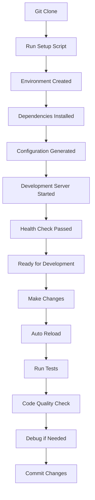

# Developer Setup and Local Development Guide

**Status**: 📋 DRAFT | **Priority**: High | **Last Updated**: 2024-12-19
**Team**: AI Development | **Progress**: 0% | **Target Release**: Phase 1.0 - January 2025
**Dependencies**: 0 Blocking | 1 Related

## Status History

| Date       | Status   | Updated By       | Notes                                        |
| ---------- | -------- | ---------------- | -------------------------------------------- |
| 2024-12-19 | 📋 DRAFT | Solo Requirement | Initial PRD creation for developer experience |

## 1. Product Overview

The Developer Setup and Local Development Guide provides comprehensive instructions, tooling, and automation to make local development of the MCP Jive system effortless and productive. This includes one-command setup, automated dependency management, development server configuration, and debugging tools.

This component ensures that developers can quickly get the MCP Jive system running locally with minimal friction, supporting the **refined minimal set of 16 essential MCP tools** and providing clear development workflows for contributing to the project.

Target: Reduce developer onboarding time from hours to under 10 minutes with automated setup and clear documentation.

## 2. Core Features

### 2.1 User Roles

| Role                | Registration Method | Core Permissions                                    |
| ------------------- | ------------------- | --------------------------------------------------- |
| New Developer       | Git clone + setup   | Full local development environment access           |
| Contributing Developer | Fork + setup     | Development, testing, and contribution capabilities |
| Maintainer          | Direct repo access  | All development features plus release management    |

### 2.2 Feature Module

Our Developer Setup system consists of:

1. **Automated Setup Script**: One-command installation, dependency management, environment configuration
2. **Development Server**: Hot-reload development mode, debugging support, test data seeding
3. **Configuration Management**: Template files, environment validation, editor integration setup
4. **Development Tools**: Testing framework, linting, formatting, debugging utilities
5. **Documentation**: Step-by-step guides, troubleshooting, contribution workflow
6. **Local Testing Environment**: Sample data, test scenarios, validation tools

### 2.3 Page Details

| Page Name                | Module Name              | Feature description                                                           |
| ------------------------ | ------------------------ | ----------------------------------------------------------------------------- |
| Automated Setup Script  | Installation Manager     | One-command setup with Python environment, dependencies, and configuration   |
| Automated Setup Script  | Dependency Resolver      | Automatic Python version detection, virtual environment creation, pip install |
| Automated Setup Script  | Environment Generator    | Create .env files from templates, validate required settings                  |
| Development Server       | Hot Reload Server        | Development mode with auto-restart on code changes                           |
| Development Server       | Debug Mode               | Enhanced logging, debug endpoints, development-only features                  |
| Development Server       | Test Data Seeder         | Populate database with sample tasks, hierarchies, and test scenarios         |
| Configuration Management | Template System          | .env.example, config templates, editor-specific settings                     |
| Configuration Management | Validation Engine        | Check required environment variables, validate paths and connections          |
| Configuration Management | Editor Integration       | VSCode settings, Cursor config, debugging configurations                     |
| Development Tools        | Testing Framework        | Unit tests, integration tests, MCP protocol testing                          |
| Development Tools        | Code Quality Tools       | Linting (flake8/black), formatting (black/isort), type checking (mypy)       |
| Development Tools        | Debugging Utilities      | MCP message inspector, database browser, log analyzer                        |
| Documentation            | Setup Guide              | Step-by-step installation, common issues, platform-specific instructions     |
| Documentation            | Development Workflow     | Code contribution process, testing guidelines, release procedures            |
| Documentation            | API Documentation        | MCP tool documentation, database schemas, configuration reference            |
| Local Testing Environment | Sample Data Generator   | Create realistic test tasks, hierarchies, and dependencies                   |
| Local Testing Environment | Test Scenarios          | Predefined test cases for workflow validation                                |
| Local Testing Environment | Validation Tools        | Health checks, connectivity tests, performance benchmarks                    |

## 3. Core Process

### Quick Start Flow (New Developer)

1. Clone repository: `git clone https://github.com/your-org/mcp-jive.git`
2. Run setup script: `./scripts/setup-dev.sh` or `python scripts/setup-dev.py`
3. Activate environment: `source venv/bin/activate` (or automatic activation)
4. Start development server: `mcp-jive dev start`
5. Verify installation: `mcp-jive dev health-check`
6. Open editor and begin development

### Development Workflow

1. Make code changes in preferred editor
2. Development server auto-reloads on file changes
3. Run tests: `mcp-jive dev test`
4. Check code quality: `mcp-jive dev lint`
5. Debug using built-in tools: `mcp-jive dev debug`
6. Commit changes with pre-commit hooks
7. Submit pull request

### Testing and Validation Flow

1. Run unit tests: `pytest tests/unit/`
2. Run integration tests: `pytest tests/integration/`
3. Test MCP protocol: `mcp-jive dev test-mcp`
4. Validate with sample data: `mcp-jive dev validate`
5. Performance benchmarks: `mcp-jive dev benchmark`
6. Full system test: `mcp-jive dev test-all`



## 4. Developer Tools and Scripts

### 4.1 Setup Script (`scripts/setup-dev.py`)

**Features:**
* Automatic Python version detection (3.9+)
* Virtual environment creation and activation
* Dependency installation with version locking
* Environment file generation from templates
* Database initialization and schema setup
* Editor configuration setup
* Validation of complete setup

**Usage:**
```bash
# Basic setup
python scripts/setup-dev.py

# With specific Python version
python scripts/setup-dev.py --python python3.11

# Skip editor setup
python scripts/setup-dev.py --no-editor

# Verbose output
python scripts/setup-dev.py --verbose
```

### 4.2 Development CLI (`mcp-jive dev`)

**Server Management:**
```bash
mcp-jive dev start          # Start development server with hot reload
mcp-jive dev stop           # Stop development server
mcp-jive dev restart        # Restart with new configuration
mcp-jive dev status         # Show server status and health
mcp-jive dev logs           # Tail development logs
```

**Testing Commands:**
```bash
mcp-jive dev test           # Run all tests
mcp-jive dev test-unit      # Unit tests only
mcp-jive dev test-integration # Integration tests only
mcp-jive dev test-mcp       # MCP protocol tests
mcp-jive dev coverage       # Test coverage report
```

**Code Quality:**
```bash
mcp-jive dev lint           # Run linting (flake8, black, isort)
mcp-jive dev format         # Auto-format code
mcp-jive dev type-check     # Run mypy type checking
mcp-jive dev security       # Security vulnerability scan
```

**Database Management:**
```bash
mcp-jive dev db-reset       # Reset database with fresh schema
mcp-jive dev db-seed        # Populate with sample data
mcp-jive dev db-backup      # Create development backup
mcp-jive dev db-restore     # Restore from backup
```

**Debugging Tools:**
```bash
mcp-jive dev debug          # Start debug mode with enhanced logging
mcp-jive dev inspect-mcp    # MCP message inspector
mcp-jive dev browse-db      # Database browser interface
mcp-jive dev health-check   # Comprehensive health check
```

### 4.3 Environment Configuration

**Development Environment Variables (`.env.dev`):**
```bash
# Development Mode
MCP_ENV=development
MCP_DEBUG=true
MCP_LOG_LEVEL=DEBUG
MCP_HOT_RELOAD=true

# Server Configuration
MCP_SERVER_HOST=localhost
MCP_SERVER_PORT=8000
MCP_SERVER_WORKERS=1

# Database Configuration
WEAVIATE_HOST=localhost
WEAVIATE_PORT=8080
WEAVIATE_DATA_PATH=./data/dev/weaviate
WEAVIATE_PERSISTENCE=true
WEAVIATE_RESET_ON_START=false

# AI Provider Configuration (Optional for development)
AI_EXECUTION_MODE=mcp_client
DEFAULT_AI_PROVIDER=anthropic
# ANTHROPIC_API_KEY=your_key_here
# OPENAI_API_KEY=your_key_here
# GOOGLE_API_KEY=your_key_here

# Development Features
DEV_SAMPLE_DATA=true
DEV_AUTO_SEED=true
DEV_MOCK_AI=true
DEV_ENABLE_PROFILING=true
```

**Editor Configurations:**

*VSCode (`.vscode/settings.json`):*
```json
{
  "python.defaultInterpreterPath": "./venv/bin/python",
  "python.linting.enabled": true,
  "python.linting.flake8Enabled": true,
  "python.formatting.provider": "black",
  "python.sortImports.args": ["--profile", "black"],
  "files.exclude": {
    "**/__pycache__": true,
    "**/venv": true,
    "data/": true
  }
}
```

*Cursor Configuration:*
```json
{
  "mcp.serverPath": "./venv/bin/mcp-jive",
  "mcp.autoConnect": true,
  "mcp.developmentMode": true
}
```

## Architecture Considerations

### Referenced Architecture Documents

* No existing architecture documents (foundational component)
* Will establish development workflow patterns for the project

### Quality Attributes Alignment

| Attribute       | Strategy                                           | Architecture Doc Reference   |
| --------------- | -------------------------------------------------- | ---------------------------- |
| Developer Experience | One-command setup, comprehensive tooling       | TBD - Developer guidelines   |
| Maintainability | Automated testing, code quality tools             | TBD - Code standards         |
| Reliability     | Comprehensive testing, validation tools           | TBD - Testing patterns       |
| Performance     | Development profiling, benchmarking tools         | TBD - Performance guidelines |
| Security        | Security scanning, safe development practices     | TBD - Security framework     |

### Architecture Validation Checkpoints

* [ ] Setup script works across different platforms (macOS, Linux, Windows)
* [ ] Development server provides adequate debugging capabilities
* [ ] Testing framework covers all critical components
* [ ] Code quality tools enforce consistent standards
* [ ] Documentation is comprehensive and up-to-date

## Related PRDs

### Dependencies (Blocking)

* None (foundational development component)

### Related (Non-blocking)

* **MCP_SERVER_CORE_INFRASTRUCTURE_PRD**: Core server implementation - Status: 📋 DRAFT

### Dependents (Blocked by this PRD)

* All development work benefits from this setup
* **AGILE_WORKFLOW_ENGINE_PRD**: Development environment needed - Status: Planned
* **TASK_STORAGE_SYNC_SYSTEM_PRD**: Development tools needed - Status: Planned
* **MCP_CLIENT_TOOLS_PRD**: Testing framework needed - Status: Planned

## Technical Requirements

### Core Dependencies

**Python Development Stack:**
* **Python**: 3.9+ with pip and venv
* **Development Tools**: black, flake8, isort, mypy, pytest
* **Documentation**: sphinx, mkdocs
* **Security**: bandit, safety
* **Performance**: py-spy, memory-profiler

**System Requirements:**
* **Operating System**: macOS, Linux, Windows (WSL2)
* **Memory**: 4GB+ available RAM
* **Storage**: 2GB+ free disk space
* **Network**: Internet connection for initial setup

### File Structure

```
mcp-jive/
├── scripts/
│   ├── setup-dev.py           # Main setup script
│   ├── setup-dev.sh           # Shell wrapper
│   ├── seed-data.py           # Sample data generator
│   └── health-check.py        # System validation
├── .env.example               # Environment template
├── .env.dev                   # Development environment
├── requirements-dev.txt       # Development dependencies
├── pyproject.toml            # Project configuration
├── .vscode/
│   ├── settings.json         # VSCode configuration
│   ├── launch.json           # Debug configuration
│   └── extensions.json       # Recommended extensions
├── tests/
│   ├── unit/                 # Unit tests
│   ├── integration/          # Integration tests
│   ├── mcp/                  # MCP protocol tests
│   └── conftest.py           # Test configuration
├── docs/
│   ├── development/
│   │   ├── setup.md          # Setup guide
│   │   ├── workflow.md       # Development workflow
│   │   ├── testing.md        # Testing guide
│   │   └── troubleshooting.md # Common issues
│   └── api/                  # API documentation
└── data/
    └── dev/                  # Development data
        ├── weaviate/         # Database files
        ├── samples/          # Sample task data
        └── backups/          # Development backups
```

### Performance Requirements

* Setup script completion: <5 minutes
* Development server startup: <10 seconds
* Hot reload response time: <2 seconds
* Test suite execution: <30 seconds
* Code quality checks: <15 seconds

### Documentation Requirements

* **Setup Guide**: Step-by-step installation for all platforms
* **Development Workflow**: Code contribution process
* **Testing Guide**: How to write and run tests
* **Troubleshooting**: Common issues and solutions
* **API Reference**: MCP tools and database schemas
* **Contributing Guide**: Pull request process and standards

### Sample Data and Test Scenarios

**Sample Task Hierarchy:**
```yaml
# data/dev/samples/sample-project.yaml
initiative:
  id: "init-001"
  title: "E-commerce Platform"
  epics:
    - id: "epic-001"
      title: "User Authentication"
      features:
        - id: "feat-001"
          title: "Login System"
          stories:
            - id: "story-001"
              title: "User can log in with email"
              tasks:
                - id: "task-001"
                  title: "Implement login API endpoint"
                - id: "task-002"
                  title: "Create login form component"
```

**Test Scenarios:**
* Task creation and hierarchy management
* Dependency validation and circular dependency detection
* MCP protocol communication and tool execution
* Database synchronization and conflict resolution
* AI model integration and execution paths
* Multi-client connection handling
* Error handling and recovery scenarios
