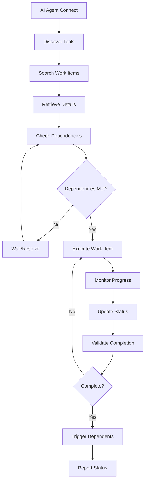

# MCP Client Tools

**Status**: 📋 DRAFT | **Priority**: High | **Last Updated**: 2024-12-19
**Team**: AI Development | **Progress**: 0% | **Target Release**: Phase 1.3 - March 2025
**Dependencies**: 3 Blocking | 1 Related

## Status History

| Date       | Status   | Updated By       | Notes                                        |
| ---------- | -------- | ---------------- | -------------------------------------------- |
| 2024-12-19 | 📋 DRAFT | Solo Requirement | Initial PRD creation from main decomposition |

## 1. Product Overview

The MCP Client Tools provide a comprehensive set of tools that AI agents can use to interact with the MCP Jive system for task management, workflow execution, and progress tracking through the Model Context Protocol.

These tools enable AI agents to autonomously manage agile workflows, search for relevant tasks, execute work items, and maintain project progress without human intervention.

## 2. Core Features

### 2.1 User Roles

| Role        | Registration Method   | Core Permissions                                  |
| ----------- | --------------------- | ------------------------------------------------- |
| AI Agent    | MCP Client connection | Full access to all workflow tools                 |
| Code Editor | MCP integration       | Access to task viewing and basic management tools |
| Developer   | Direct tool access    | Administrative access to all tools                |

### 2.2 Feature Module

Our MCP Client Tools consist of:

1. **Task Management Tools**: Create, read, update, delete work items and relationships
2. **Search and Discovery Tools**: Semantic search, keyword search, relationship navigation
3. **Workflow Execution Tools**: Execute work items, monitor progress, handle validation
4. **Progress Tracking Tools**: Update status, calculate progress, report metrics
5. **Dependency Management Tools**: Manage dependencies, resolve conflicts, track blockers
6. **Validation and Quality Tools**: Verify completion, run quality checks, validate criteria

### 2.3 Page Details

| Page Name                    | Module Name             | Feature description                                                         |
| ---------------------------- | ----------------------- | --------------------------------------------------------------------------- |
| Task Management Tools        | Work Item CRUD          | Create new work items, read existing items, update properties, delete items |
| Task Management Tools        | Relationship Manager    | Establish parent-child relationships, manage dependencies, update hierarchy |
| Task Management Tools        | Metadata Handler        | Update descriptions, acceptance criteria, effort estimates, priorities      |
| Search and Discovery Tools   | Semantic Search         | Vector-based search across task descriptions and content                    |
| Search and Discovery Tools   | Keyword Search          | Text-based search with filters, sorting, and ranking                        |
| Search and Discovery Tools   | Relationship Navigation | Navigate hierarchy, find related items, explore dependencies                |
| Workflow Execution Tools     | Execution Controller    | Start, pause, resume, stop work item execution                              |
| Workflow Execution Tools     | Progress Monitor        | Track execution status, monitor agent activity, handle errors               |
| Workflow Execution Tools     | Validation Engine       | Verify completion against acceptance criteria, run quality checks           |
| Progress Tracking Tools      | Status Updater          | Update work item status, record progress, log activities                    |
| Progress Tracking Tools      | Metrics Calculator      | Calculate completion percentages, estimate remaining effort                 |
| Progress Tracking Tools      | Reporting Engine        | Generate progress reports, milestone notifications, status summaries        |
| Dependency Management Tools  | Dependency Tracker      | Add, remove, modify dependencies between work items                         |
| Dependency Management Tools  | Blocker Manager         | Identify blockers, escalate issues, track resolution                        |
| Dependency Management Tools  | Conflict Resolver       | Detect and resolve dependency conflicts, circular dependencies              |
| Validation and Quality Tools | Completion Validator    | Verify work item completion against defined criteria                        |
| Validation and Quality Tools | Quality Checker         | Run automated quality checks, code analysis, testing validation             |
| Validation and Quality Tools | Acceptance Tester       | Validate acceptance criteria, user story completion                         |

## 3. Core Process

### AI Agent Workflow Interaction

1. AI agent connects to MCP server
2. Discovers available tools through MCP protocol
3. Searches for relevant work items using search tools
4. Retrieves work item details and dependencies
5. Executes work items using execution tools
6. Updates progress using tracking tools
7. Validates completion using quality tools
8. Reports status and triggers dependent items

### Task Creation and Management Flow

1. AI agent receives requirements or PRD
2. Uses decomposition tools to break down into hierarchy
3. Creates Initiative, Epic, Feature, Story, Task items
4. Establishes relationships and dependencies
5. Sets priorities and effort estimates
6. Validates hierarchy integrity
7. Stores in database and syncs to files

### Execution and Monitoring Flow

1. AI agent selects work item for execution
2. Validates all dependencies are satisfied
3. Retrieves execution context and requirements
4. Starts execution using appropriate tools
5. Monitors progress and handles errors
6. Updates status throughout execution
7. Validates completion and quality
8. Triggers execution of dependent items



## 4. MCP Tool Categories

### 4.1 Task Management Tools

* **create_work_item**: Create new agile work items (Initiative/Epic/Feature/Story/Task)
* **get_work_item**: Retrieve work item details by ID
* **update_work_item**: Update work item properties, status, and relationships
* **delete_work_item**: Delete work items with proper dependency handling
* **list_work_items**: List work items with filtering and pagination

### 4.2 Search and Discovery Tools

* **search_work_items**: Semantic and keyword search across work items
* **get_work_item_children**: Retrieve child work items in hierarchy
* **get_work_item_dependencies**: Get dependency relationships
* **find_related_items**: Find semantically related work items
* **get_work_item_hierarchy**: Retrieve complete hierarchy tree

### 4.3 Workflow Execution Tools

* **execute_work_item**: Start autonomous execution of work items
* **get_execution_status**: Monitor execution progress and status
* **cancel_execution**: Cancel ongoing executions
* **validate_completion**: Validate work item completion
* **trigger_dependent_execution**: Execute dependent work items

### 4.4 Progress Tracking Tools

* **update_work_item_status**: Update status and progress
* **get_progress_summary**: Get progress metrics and summaries
* **track_execution_metrics**: Track performance and completion metrics
* **generate_status_report**: Generate progress reports
* **sync_progress_data**: Synchronize progress with storage systems

## Architecture Considerations

### Referenced Architecture Documents

* **MCP\_SERVER\_CORE\_INFRASTRUCTURE\_PRD**: Server and tool registration foundation - Status: 📋 DRAFT

* **AGILE\_WORKFLOW\_ENGINE\_PRD**: Workflow execution capabilities - Status: 📋 DRAFT

* **TASK\_STORAGE\_SYNC\_SYSTEM\_PRD**: Data access and search capabilities - Status: 📋 DRAFT

### Quality Attributes Alignment

| Attribute       | Strategy                                           | Architecture Doc Reference   |
| --------------- | -------------------------------------------------- | ---------------------------- |
| Scalability     | Efficient tool execution, batch operations         | TBD - Tool architecture      |
| Performance     | Fast tool response times, optimized queries        | TBD - Performance guidelines |
| Security        | Secure tool access, input validation               | TBD - Security framework     |
| Reliability     | Robust error handling, transaction safety          | TBD - Reliability patterns   |
| Maintainability | Clear tool interfaces, comprehensive documentation | TBD - Code standards         |

### Architecture Validation Checkpoints

* [ ] All tools follow MCP protocol specifications

* [ ] Tool parameters are properly validated

* [ ] Error handling provides meaningful feedback

* [ ] Tool execution is atomic and safe

* [ ] Performance meets response time requirements

## Related PRDs

### Dependencies (Blocking)

* **MCP\_SERVER\_CORE\_INFRASTRUCTURE\_PRD**: Requires server and tool registration - Status: 📋 DRAFT

* **AGILE\_WORKFLOW\_ENGINE\_PRD**: Requires workflow execution engine - Status: 📋 DRAFT

* **TASK\_STORAGE\_SYNC\_SYSTEM\_PRD**: Requires data access and search - Status: 📋 DRAFT

### Related (Non-blocking)

* **MCP\_JIVE\_AUTONOMOUS\_AI\_BUILDER\_PRD**: Parent PRD - Status: 📋 DRAFT

### Dependents (Blocked by this PRD)

* **PROGRESS\_TRACKING\_DASHBOARD\_PRD**: Requires tool data for visualization - Status: Planned

## Technical Requirements

### MCP Tool Definitions

#### Task Management Tools

```python
@mcp_tool
async def create_work_item(
    type: WorkItemType,
    title: str,
    description: str,
    parent_id: Optional[str] = None,
    priority: Priority = Priority.MEDIUM
) -> WorkItem:
    """Create a new work item in the hierarchy"""

@mcp_tool
async def get_work_item(work_item_id: str) -> WorkItem:
    """Retrieve a work item by ID"""

@mcp_tool
async def update_work_item(
    work_item_id: str,
    updates: Dict[str, Any]
) -> WorkItem:
    """Update work item properties"""

@mcp_tool
async def delete_work_item(work_item_id: str) -> bool:
    """Delete a work item and handle relationships"""
```

#### Search and Discovery Tools

```python
@mcp_tool
async def search_work_items(
    query: str,
    search_type: SearchType = SearchType.SEMANTIC,
    filters: Optional[Dict[str, Any]] = None,
    limit: int = 10
) -> List[WorkItemSearchResult]:
    """Search for work items using various strategies"""

@mcp_tool
async def get_work_item_children(work_item_id: str) -> List[WorkItem]:
    """Get all child work items"""

@mcp_tool
async def get_work_item_dependencies(work_item_id: str) -> List[WorkItem]:
    """Get all dependencies for a work item"""
```

#### Workflow Execution Tools

```python
@mcp_tool
async def execute_work_item(
    work_item_id: str,
    execution_context: Optional[Dict[str, Any]] = None
) -> ExecutionResult:
    """Execute a work item autonomously"""

@mcp_tool
async def get_execution_status(execution_id: str) -> ExecutionStatus:
    """Get current execution status"""

@mcp_tool
async def cancel_execution(execution_id: str) -> bool:
    """Cancel an ongoing execution"""
```

#### Progress Tracking Tools

```python
@mcp_tool
async def update_work_item_status(
    work_item_id: str,
    status: WorkItemStatus,
    notes: Optional[str] = None
) -> WorkItem:
    """Update work item status"""

@mcp_tool
async def calculate_progress(work_item_id: str) -> ProgressReport:
    """Calculate completion progress for work item hierarchy"""

@mcp_tool
async def get_progress_report(
    scope: str = "all",
    include_metrics: bool = True
) -> DetailedProgressReport:
    """Generate comprehensive progress report"""
```

### Tool Response Formats

```python
class WorkItemSearchResult:
    work_item: WorkItem
    relevance_score: float
    match_highlights: List[str]

class ExecutionResult:
    execution_id: str
    status: ExecutionStatus
    started_at: datetime
    completed_at: Optional[datetime]
    result_data: Optional[Dict[str, Any]]
    error_message: Optional[str]

class ProgressReport:
    work_item_id: str
    completion_percentage: float
    completed_children: int
    total_children: int
    estimated_completion: Optional[datetime]
```

### Performance Requirements

* Tool response time: <200ms for simple operations

* Search tool response: <500ms for complex queries

* Execution tool startup: <2 seconds

* Progress calculation: <100ms for hierarchy updates

* Concurrent tool calls: 10+ simultaneous operations

### Error Handling

* Comprehensive input validation

* Meaningful error messages

* Graceful degradation for partial failures

* Retry mechanisms for transient errors

* Detailed logging for debugging

### Security Requirements

* Input sanitization for all parameters

* Access control for sensitive operations

* Audit logging for all tool usage

* Rate

