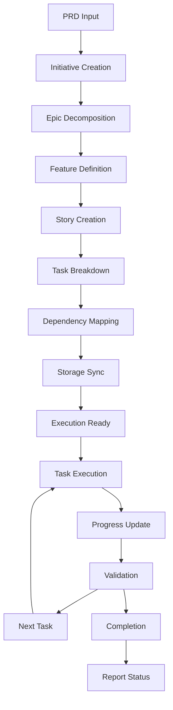

# MCP Jive - Autonomous AI Code Builder

**Status**: 📋 DRAFT | **Priority**: High | **Last Updated**: 2024-12-19
**Team**: AI Development | **Progress**: 0% | **Target Release**: Phase 1 - Q1 2025
**Dependencies**: 0 Blocking | 0 Related

## Status History

| Date       | Status   | Updated By       | Notes                |
| ---------- | -------- | ---------------- | -------------------- |
| 2024-12-19 | 📋 DRAFT | Solo Requirement | Initial PRD creation |

## 1. Product Overview

MCP Jive is an autonomous AI code building system that enables AI agents to develop software with minimal human intervention through a **refined minimal set of 16 essential MCP tools** - streamlined from 47 original tools while maintaining core functionality for agile workflow management, memory systems, and architecture steering.

The system addresses the critical need for AI agents to work autonomously on complex software projects by providing structured task decomposition, progress tracking, and intelligent context management across multiple development environments using only the most essential tools.

**Critical Architectural Principle**: The MCP Server **NEVER** directly accesses MCP Client code projects or local file systems. The MCP Client is **SOLELY RESPONSIBLE** for all local file operations within client projects. All file-related operations are coordinated through the MCP Client and communicated to the server via the MCP protocol, ensuring proper security boundaries, separation of concerns, and preventing unauthorized access to client codebases.

Target market value: Revolutionize AI-assisted software development by enabling truly autonomous coding workflows that can handle enterprise-scale projects with maximum efficiency and minimal tool complexity.

## 2. Core Features

### 2.1 User Roles

| Role            | Registration Method   | Core Permissions                                      |
| --------------- | --------------------- | ----------------------------------------------------- |
| Developer       | Local installation    | Full access to all MCP tools and workflow management  |
| AI Agent        | MCP Client connection | Execute tasks, update progress, access context        |
| Project Manager | Configuration access  | View progress, modify priorities, configure workflows |

### 2.2 Feature Module

Our MCP Jive system consists of the following main components:

1. **MCP Server Core**: Python-based server with embedded Weaviate database, environment configuration management
2. **Agile Workflow Engine**: Initiative/Epic/Feature/Story/Task hierarchy management, dependency tracking, autonomous execution
3. **Task Storage System**: Local .jivedev/tasks/\* folder structure, bidirectional sync with Weaviate vector database
4. **MCP Client Tools**: Search, retrieval, storage, and execution tools for AI agents
5. **Progress Tracking Dashboard**: Real-time status monitoring, validation systems, completion verification
6. **Configuration Management**: Environment variables, .env file support, multi-editor compatibility

### 2.3 Page Details

| Page Name                   | Module Name           | Feature description                                                                                       |
| --------------------------- | --------------------- | --------------------------------------------------------------------------------------------------------- |
| **Architectural Boundary** | **Client-Server Separation** | **MCP Server NEVER accesses client files directly - ALL operations via MCP Client** |
| MCP Server Core             | Python Server         | Initialize embedded Weaviate instance, load configuration from .env files, provide MCP protocol endpoints |
| MCP Server Core             | Configuration Manager | Parse environment variables, validate settings, manage multi-editor compatibility settings                |
| Agile Workflow Engine       | Hierarchy Manager     | Create and manage Initiative→Epic→Feature→Story→Task relationships, track dependencies                    |
| Agile Workflow Engine       | Autonomous Executor   | Execute work items sequentially via MCP Client, validate completion, trigger child item execution        |
| Agile Workflow Engine       | Progress Tracker      | Update status, calculate completion percentages, manage blockers and dependencies                         |
| Task Storage System         | **MCP Client File Ops** | **MCP Client reads/writes .jivedev/tasks/\* folder structure, maintains JSON/YAML task definitions**     |
| Task Storage System         | Weaviate Sync         | Bidirectional synchronization between MCP Client file data and vector database, conflict resolution      |
| Task Storage System         | Vector Search         | Semantic search across tasks, keyword search, relationship queries                                        |
| MCP Client Tools            | Task Retrieval        | Search tasks by criteria, get task details, fetch related items                                           |
| MCP Client Tools            | Task Management       | Create, update, delete tasks, modify relationships, set priorities                                        |
| MCP Client Tools            | Execution Control     | Start task execution, monitor progress, handle validation                                                 |
| Progress Tracking Dashboard | Status Monitor        | Real-time progress visualization, dependency graphs, completion metrics                                   |
| Progress Tracking Dashboard | Validation System     | Verify task completion via MCP Client, run automated tests, confirm deliverables                         |

## 3. Core Process

### Developer Flow

1. Developer installs MCP Jive server locally
2. Configures environment variables and .env files
3. Connects preferred code editor (VSCode, Cursor, Trae, etc.)
4. Creates or imports PRD document
5. Uses AI agent to decompose PRD into agile hierarchy
6. Monitors progress through dashboard
7. Reviews and validates completed work

### AI Agent Flow

1. AI agent connects to MCP server via client
2. Receives task execution request (Epic, Feature, Story, or Task)
3. Retrieves task details and dependencies from Weaviate
4. Executes work items in dependency order
5. Updates progress and validates completion
6. Triggers execution of dependent tasks
7. Reports completion status to developer

### Task Decomposition Flow

1. PRD input received
2. AI agent analyzes requirements
3. Creates Initiative level objectives
4. Breaks down into Epics with business value
5. Decomposes Epics into Features
6. Creates Stories with user value
7. Defines Tasks with implementation steps
8. Establishes dependencies and relationships
9. Stores in both local files and Weaviate

## 4. MCP Server API Design

### 4.1 MCP Protocol Implementation

* **Protocol Version**: MCP 2024-11-05 specification compliance
* **Transport**: stdio and SSE (Server-Sent Events) support
* **Authentication**: Local server authentication for secure tool access
* **Error Handling**: Standardized MCP error responses with detailed context
* **Logging**: Structured logging for debugging and monitoring

### 4.2 Refined Minimal MCP Tools (16 Essential Tools)

**Core Work Item Management (5 tools):**
| Tool Name | Description |
| --------- | ----------- |
| create_work_item | Create new agile work items (Initiative/Epic/Feature/Story/Task) |
| get_work_item | Retrieve work item details by ID |
| update_work_item | Update work item properties, status, and relationships |
| list_work_items | List work items with filtering and pagination |
| search_work_items | Semantic and keyword search across work items |

**Simple Hierarchy & Dependencies (3 tools):**
| Tool Name | Description |
| --------- | ----------- |
| get_work_item_children | Get child tasks for a work item |
| get_work_item_dependencies | Check what blocks this task |
| validate_dependencies | Ensure no circular dependencies |

**Execution Control (3 tools):**
| Tool Name | Description |
| --------- | ----------- |
| execute_work_item | Start autonomous execution of work item |
| get_execution_status | Monitor real-time execution progress |
| cancel_execution | Stop and rollback work item execution |

**Storage & Sync (3 tools):**
| Tool Name | Description |
| --------- | ----------- |
| sync_file_to_database | Sync local task metadata to vector database |
| sync_database_to_file | Sync database changes to local task files |
| get_sync_status | Check synchronization status of task metadata |

**Validation (2 tools):**
| Tool Name | Description |
| --------- | ----------- |
| validate_completion | Check if task meets acceptance criteria |
| validate_file_format | Ensure task metadata and .jivedev file format compliance |

### 4.3 Data Exchange Formats

**JSON Schema**: All MCP tool inputs/outputs use structured JSON with validation
**File Formats**: Local storage uses YAML for human readability and JSON for processing
**Vector Embeddings**: Text embeddings for semantic search and relationship discovery

## Architecture Considerations

### Referenced Architecture Documents

* No existing architecture documents found (new project)

* Will create foundational architecture documentation

### Quality Attributes Alignment

| Attribute       | Strategy                                                   | Architecture Doc Reference   |
| --------------- | ---------------------------------------------------------- | ---------------------------- |
| Scalability     | Embedded Weaviate with horizontal scaling capability       | TBD - Architecture docs      |
| Performance     | Vector search optimization, local file caching             | TBD - Performance guidelines |
| Security        | Local-only operation, no external data transmission        | TBD - Security framework     |
| Reliability     | Bidirectional sync, conflict resolution, backup strategies | TBD - Reliability patterns   |
| Maintainability | Modular Python architecture, clear separation of concerns  | TBD - Code standards         |

### Architecture Validation Checkpoints

* [ ] Component boundaries defined between MCP server, Weaviate, and file system

* [ ] Integration contracts specified for MCP protocol and editor plugins

* [ ] Data flow documented for task synchronization and execution

* [ ] Failure modes identified for sync conflicts and execution errors

## Related PRDs

### Dependencies (Blocking)

* None (foundational project)

### Related (Non-blocking)

* **PHASE\_2\_ARCHITECTURE\_STEERING\_PRD**: Architecture documentation system - Status: TBD

* **PHASE\_3\_MEMORY\_SYSTEM\_PRD**: AI agent memory management - Status: TBD

* **PHASE\_4\_DOCUMENTATION\_SYSTEM\_PRD**: Automated documentation generation - Status: TBD

### Dependents (Blocked by this PRD)

* **PHASE\_2\_ARCHITECTURE\_STEERING\_PRD**: Requires core MCP infrastructure

* **PHASE\_3\_MEMORY\_SYSTEM\_PRD**: Requires task management foundation

* **PHASE\_4\_DOCUMENTATION\_SYSTEM\_PRD**: Requires complete workflow system

## Technical Requirements

### Core Technology Stack

* **Language**: Python 3.9+

* **Database**: Embedded Weaviate vector database

* **Protocol**: MCP (Model Context Protocol)

* **Configuration**: Environment variables, .env files

* **Storage**: Local file system (.jivedev/tasks/\*)

### Integration Requirements

* **Code Editors**: VSCode, Cursor, Trae, Windsurf, Cline

* **AI Platforms**: Claude Code, Gemini CLI

* **File Formats**: JSON/YAML for task definitions

* **Sync Protocol**: Bidirectional file-database synchronization

### Performance Requirements

* Task search response time: <100ms

* File-database sync time: <1s for typical project

* Concurrent AI agent support: 5+ agents

* Memory usage: <500MB for typical project

### Security Requirements

* Local-only operation (no external data transmission)

* Secure configuration management

* Task data encryption at rest

* Access control for multi-user scenarios

