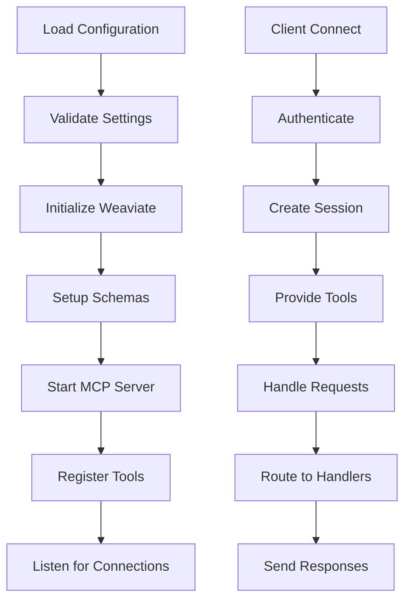

# MCP Server Core Infrastructure

**Status**: 📋 DRAFT | **Priority**: High | **Last Updated**: 2024-12-19
**Team**: AI Development | **Progress**: 0% | **Target Release**: Phase 1.1 - January 2025
**Dependencies**: 0 Blocking | 1 Related

## Status History

| Date       | Status   | Updated By       | Notes                                        |
| ---------- | -------- | ---------------- | -------------------------------------------- |
| 2024-12-19 | 📋 DRAFT | Solo Requirement | Initial PRD creation from main decomposition |

## 1. Product Overview

The MCP Server Core Infrastructure provides the foundational Python-based server with embedded Weaviate vector database and comprehensive configuration management for the MCP Jive autonomous AI building system.

This component establishes the technical foundation that enables AI agents to connect, store data, and execute workflows through a robust, locally-hosted MCP protocol server.

## 2. Core Features

### 2.1 User Roles

| Role                 | Registration Method   | Core Permissions                           |
| -------------------- | --------------------- | ------------------------------------------ |
| System Administrator | Local installation    | Full server configuration and management   |
| AI Agent             | MCP Client connection | Connect to server, access configured tools |
| Developer            | Configuration access  | Modify settings, monitor server status     |

### 2.2 Feature Module

Our MCP Server Core Infrastructure consists of:

1. **Python MCP Server**: Protocol implementation, client connection management, tool registration
2. **Embedded Weaviate Database**: Vector database setup, schema configuration, data persistence
3. **Configuration Management**: Environment variable parsing, .env file support, validation
4. **Connection Manager**: Multi-editor support, client authentication, session management
5. **Health Monitoring**: Server status, database health, performance metrics

### 2.3 Page Details

| Page Name                  | Module Name           | Feature description                                                                 |
| -------------------------- | --------------------- | ----------------------------------------------------------------------------------- |
| Python MCP Server          | Server Initialization | Start MCP protocol server, register available tools, handle client connections      |
| Python MCP Server          | Tool Registry         | Register task management tools, workflow execution tools, search capabilities       |
| Python MCP Server          | Client Handler        | Manage multiple AI agent connections, session state, request routing                |
| Embedded Weaviate Database | Database Setup        | Initialize embedded Weaviate instance, configure vector schemas, set up collections |
| Embedded Weaviate Database | Schema Manager        | Define task hierarchy schemas, relationship mappings, vector embeddings             |
| Embedded Weaviate Database | Data Persistence      | Handle database startup/shutdown, backup strategies, data integrity                 |
| Configuration Management   | Environment Parser    | Load .env files, parse environment variables, validate configuration                |
| Configuration Management   | Settings Validator    | Verify required settings, check database paths, validate editor configurations      |
| Configuration Management   | Dynamic Config        | Hot-reload configuration changes, update runtime settings                           |
| Connection Manager         | Editor Integration    | Support VSCode, Cursor, Trae, Windsurf, Cline connections                           |
| Connection Manager         | Authentication        | Secure client connections, session management, access control                       |
| Health Monitoring          | Status Endpoint       | Provide server health status, database connectivity, performance metrics            |
| Health Monitoring          | Logging System        | Structured logging, error tracking, debug information                               |

## 3. Core Process

### Server Startup Flow

1. Load configuration from .env files and environment variables
2. Validate all required settings and paths
3. Initialize embedded Weaviate database
4. Set up vector schemas for task hierarchy
5. Start MCP protocol server
6. Register all available tools
7. Begin listening for client connections
8. Log startup status and health metrics

### Client Connection Flow

1. AI agent or editor initiates MCP connection
2. Server authenticates client and creates session
3. Server provides available tool list
4. Client can invoke registered tools
5. Server routes requests to appropriate handlers
6. Responses sent back through MCP protocol
7. Session maintained until client disconnects

### Configuration Update Flow

1. Configuration file changes detected
2. Validate new configuration settings
3. Apply non-disruptive changes immediately
4. Queue disruptive changes for next restart
5. Notify connected clients of relevant changes
6. Log configuration update status



## 4. MCP Server Core API

### 4.1 MCP Protocol Implementation

**Server Capabilities:**
* MCP protocol version 1.0 compliance
* Bidirectional JSON-RPC communication
* Tool registration and discovery
* Session management and authentication
* Error handling and status reporting

**Connection Management:**
* WebSocket and HTTP transport support
* Client authentication and authorization
* Session lifecycle management
* Concurrent connection handling
* Graceful disconnection and cleanup

### 4.2 Core MCP Tools

**Health and Status Tools:**
* `get_server_status` - Retrieve server health and performance metrics
* `get_connection_info` - List active client connections
* `validate_configuration` - Check configuration validity
* `restart_server` - Gracefully restart server components

**Database Management Tools:**
* `initialize_database` - Set up Weaviate schemas and indexes
* `backup_database` - Create database backup
* `restore_database` - Restore from backup
* `optimize_database` - Run database optimization routines
* `get_database_stats` - Retrieve database performance metrics

**Configuration Tools:**
* `get_configuration` - Retrieve current server configuration
* `update_configuration` - Modify server settings
* `reload_configuration` - Apply configuration changes
* `validate_env_vars` - Check environment variable validity

### 4.3 Logging and Monitoring

**Log Levels and Categories:**
```json
{
  "levels": ["DEBUG", "INFO", "WARNING", "ERROR", "CRITICAL"],
  "categories": {
    "server": "Core server operations",
    "database": "Weaviate operations",
    "mcp": "MCP protocol handling",
    "auth": "Authentication events",
    "performance": "Performance metrics"
  }
}
```

**Health Check Endpoints:**
* Server status and uptime
* Database connectivity and performance
* Memory and CPU usage
* Active client connections
* Error rates and response times

## Architecture Considerations

### Referenced Architecture Documents

* No existing architecture documents (foundational component)

* Will establish core architecture patterns for the project

### Quality Attributes Alignment

| Attribute       | Strategy                                           | Architecture Doc Reference   |
| --------------- | -------------------------------------------------- | ---------------------------- |
| Scalability     | Embedded database with upgrade path to distributed | TBD - Scalability patterns   |
| Performance     | Local operation, efficient vector operations       | TBD - Performance guidelines |
| Security        | Local-only operation, secure client authentication | TBD - Security framework     |
| Reliability     | Robust error handling, graceful degradation        | TBD - Reliability patterns   |
| Maintainability | Clean separation of concerns, modular design       | TBD - Code standards         |

### Architecture Validation Checkpoints

* [ ] MCP protocol implementation follows specification

* [ ] Weaviate integration properly isolated and configurable

* [ ] Configuration system supports all required settings

* [ ] Client connection handling is secure and scalable

* [ ] Error handling and logging provide adequate debugging

## Related PRDs

### Dependencies (Blocking)

* None (foundational component)

### Related (Non-blocking)

* **MCP\_JIVE\_AUTONOMOUS\_AI\_BUILDER\_PRD**: Parent PRD - Status: 📋 DRAFT

### Dependents (Blocked by this PRD)

* **AGILE\_WORKFLOW\_ENGINE\_PRD**: Requires MCP server and database - Status: Planned

* **TASK\_STORAGE\_SYNC\_SYSTEM\_PRD**: Requires database infrastructure - Status: Planned

* **MCP\_CLIENT\_TOOLS\_PRD**: Requires server and tool registration - Status: Planned

## Technical Requirements

### Core Dependencies

* **Python**: 3.9+ with asyncio support

* **Weaviate**: Embedded instance with Python client

* **MCP Protocol**: Official Python MCP library

* **Configuration**: python-dotenv for .env support

* **Logging**: structlog for structured logging

### Environment Variables

```bash
# Server Configuration
MCP_SERVER_HOST=localhost
MCP_SERVER_PORT=8000
MCP_SERVER_LOG_LEVEL=INFO

# Weaviate Configuration
WEAVIATE_HOST=localhost
WEAVIATE_PORT=8080
WEAVIATE_DATA_PATH=./data/weaviate
WEAVIATE_PERSISTENCE=true

# Security
MCP_AUTH_ENABLED=true
MCP_AUTH_TOKEN_SECRET=<generated>

# Performance
MAX_CONCURRENT_CLIENTS=10
REQUEST_TIMEOUT=30
DATABASE_POOL_SIZE=5
```

### File Structure

```
mcp-jive/
├── src/
│   ├── mcp_server/
│   │   ├── __init__.py
│   │   ├── server.py
│   │   ├── config.py
│   │   ├── database.py
│   │   └── tools/
│   └── tests/
├── data/
│   └── weaviate/
├── .env.example
├── requirements.txt
└── README.md
```

### Performance Requirements

* Server startup time: <5 seconds

* Client connection time: <1 second

* Database query response: <100ms

* Memory usage: <200MB baseline

* Concurrent client support: 10+ connections

### Security Requirements

* Local-only database access

* Secure client authentication

* Configuration validation

* Input sanitization for all requests

* <br />

