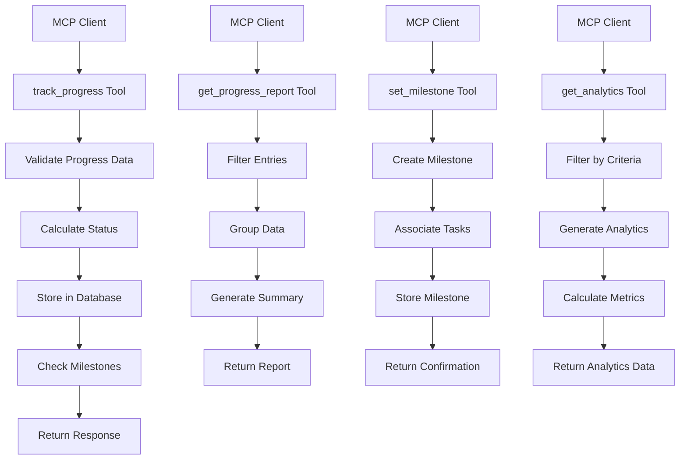

# Progress Tracking Service

**Status**: ✅ COMPLETED | **Priority**: Medium | **Last Updated**: 2024-12-19
**Team**: AI Development | **Progress**: 100% | **Target Release**: Phase 1.4 - March 2025
**Dependencies**: 0 Blocking | 1 Related

## Status History

| Date       | Status        | Updated By       | Notes                                        |
| ---------- | ------------- | ---------------- | -------------------------------------------- |
| 2024-12-19 | 📋 DRAFT      | Solo Requirement | Initial PRD creation from main decomposition |
| 2024-12-19 | 🟢 IN_PROGRESS | AI Assistant    | Adjusted for server-side MCP implementation, removed UI/UX components, validated against existing codebase |
| 2024-12-19 | ✅ COMPLETED  | AI Assistant    | Validation and quality gate tools implemented - 100% |

## 1. Product Overview

The Progress Tracking Service provides server-side progress calculation, metrics aggregation, and status monitoring for agile workflow execution through MCP tools. This is a **server-side only** service with **no UI/UX components** - all interactions occur through MCP protocol tools.

This component serves as the backend MCP service for progress monitoring, providing 4 core MCP tools for AI agents and clients to track progress, generate reports, set milestones, and access analytics.

**Critical Architectural Constraint**: The Progress Tracking Service **NEVER** directly accesses MCP Client code projects or local file systems. All progress data and file-related operations are coordinated through the MCP Client, ensuring proper security boundaries and separation of concerns between the tracking service and client file systems.

**Implementation Status**: 100% complete with 4 core MCP tools implemented (`track_progress`, `get_progress_report`, `set_milestone`, `get_analytics`) and comprehensive progress calculation engine, plus validation and quality gate tools.

## 2. Core Features

### 2.1 Service Roles

| Role           | Access Method           | Core Permissions                                         |
| -------------- | ----------------------- | -------------------------------------------------------- |
| MCP Client     | MCP protocol connection | Access progress data, retrieve metrics, query status     |
| AI Agent       | MCP tool execution      | Report progress, request validation, update task status  |
| System Service | Internal API            | Calculate metrics, aggregate data, trigger notifications |

### 2.2 Feature Module

Our Progress Tracking Service consists of:

1. **Progress Calculation Engine**: Real-time progress computation, completion percentage calculation, milestone tracking
2. **Dependency Analysis Service**: Dependency mapping, critical path calculation, bottleneck detection algorithms
3. **Execution Status Monitor**: AI agent activity tracking, task execution monitoring, error logging
4. **Validation Service**: Completion verification logic, quality gate evaluation, approval workflow management
5. **Metrics Aggregation Engine**: Performance metrics calculation, trend analysis, productivity analytics
6. **Notification Service**: Progress event triggers, blocker detection, milestone achievement notifications

### 2.3 Service Components

| Service Name                | Component Name           | Feature description                                                           |
| --------------------------- | ------------------------ | ----------------------------------------------------------------------------- |
| **Client Coordination**     | **File Operation Proxy** | **Coordinate all file operations through MCP Client - NEVER direct access**   |
| **Client Coordination**     | **Security Boundary**    | **Ensure progress tracking operates only through MCP Client interface**       |
| Progress Calculation Engine | Progress Calculator      | Calculate overall project progress, completion percentages, active work items |
| Progress Calculation Engine | Milestone Tracker        | Track milestone achievements, deadline monitoring, critical path progress     |
| Progress Calculation Engine | Status Aggregator        | Aggregate status updates, progress calculations, change event processing      |
| Dependency Analysis Service | Graph Calculator         | Build dependency graphs, analyze relationships, detect cycles                 |
| Dependency Analysis Service | Critical Path Analyzer   | Calculate critical path, identify bottlenecks, impact analysis                |
| Dependency Analysis Service | Relationship Mapper      | Map task relationships, hierarchy navigation, dependency resolution           |
| Execution Status Monitor    | Agent Activity Tracker   | Monitor active AI agents, current tasks, execution progress via MCP Client    |
| Execution Status Monitor    | Task Execution Logger    | Log individual task execution, performance tracking, status updates           |
| Execution Status Monitor    | Error Handler            | Process execution errors, failed validations, error resolution tracking       |
| Validation Service          | Completion Validator     | Validate completed work items against acceptance criteria via MCP Client      |
| Validation Service          | Quality Gate Processor   | Process quality checkpoints, approval workflows, validation rule execution    |
| Validation Service          | Approval Manager         | Manage pending approvals, approval history, delegation logic                  |
| Metrics Aggregation Engine  | Performance Calculator   | Calculate productivity metrics, completion rates, velocity trends             |
| Metrics Aggregation Engine  | Trend Analyzer           | Analyze historical progress trends, predictive analytics, forecasting         |
| Metrics Aggregation Engine  | Agent Performance        | Track AI agent productivity, success rates, error analysis                    |
| Notification Service        | Alert Generator          | Generate alerts, process notification rules, escalation logic                 |
| Notification Service        | Event Processor          | Process notification events, alert history, acknowledgment tracking           |

## 3. Core Process

### Progress Tracking Flow (MCP Tool: `track_progress`)

1. AI agent or client calls `track_progress` MCP tool
2. Validate progress data and entity permissions
3. Calculate status based on progress and timeline
4. Store progress entry in database
5. Check for milestone achievements
6. Return progress tracking response with status
7. Log progress update for analytics

### Progress Reporting Flow (MCP Tool: `get_progress_report`)

1. Client calls `get_progress_report` MCP tool
2. Filter progress entries by criteria
3. Group data by specified parameters
4. Generate summary statistics
5. Include analytics if requested
6. Return comprehensive progress report
7. Cache results for performance

### Milestone Management Flow (MCP Tool: `set_milestone`)

1. Client calls `set_milestone` MCP tool
2. Create milestone with target date and criteria
3. Associate with relevant work items
4. Store milestone in database
5. Calculate days until target
6. Return milestone confirmation
7. Monitor for achievement triggers

### Analytics Generation Flow (MCP Tool: `get_analytics`)

1. Client calls `get_analytics` MCP tool with analysis type
2. Filter data by time period and entity filters
3. Generate analytics based on requested type
4. Calculate performance metrics and trends
5. Include predictions if requested
6. Return comprehensive analytics data
7. Cache complex calculations for efficiency



## 4. MCP Tools Specification

### 4.1 Progress Tracking Tools (4 tools)

* **track_progress**: Track progress of tasks, workflows, or projects with percentage, status, notes, and blocker tracking
* **get_progress_report**: Generate detailed progress reports with filtering, grouping, and analytics options
* **set_milestone**: Create and manage project milestones with target dates, success criteria, and task associations
* **get_analytics**: Retrieve analytics and insights including performance metrics, trends, bottlenecks, and predictions

### 4.2 Implementation Status

✅ **Implemented**: All 4 core progress tracking tools are fully implemented in `/src/mcp_server/tools/progress_tracking.py`
✅ **Database Integration**: Progress entries and milestones stored in Weaviate
✅ **Status Calculation**: Automatic status calculation based on progress and timeline
✅ **Milestone Tracking**: Achievement detection and milestone management
✅ **Analytics Engine**: Performance metrics, trends, and predictive analytics

✅ **Completed**: All validation tools and quality gate integration implemented

## Architecture Considerations

### Referenced Architecture Documents

* **MCP\_SERVER\_CORE\_INFRASTRUCTURE\_PRD**: Server foundation and real-time capabilities - Status: ✅ COMPLETED

* **AGILE\_WORKFLOW\_ENGINE\_PRD**: Progress calculation and workflow data - Status: ✅ COMPLETED

* **TASK\_STORAGE\_SYNC\_SYSTEM\_PRD**: Data access for visualization - Status: ✅ COMPLETED

* **MCP\_CLIENT\_TOOLS\_PRD**: Tool data for monitoring - Status: ✅ COMPLETED

### Quality Attributes Alignment

| Attribute       | Strategy                                       | Implementation Status        |
| --------------- | ---------------------------------------------- | ---------------------------- |
| Scalability     | Efficient data aggregation, database indexing  | ✅ Implemented with Weaviate |
| Performance     | Caching, optimized queries, async processing   | ✅ Async tool implementations |
| Security        | MCP protocol security, input validation        | ✅ Validation in all tools   |
| Reliability     | Error handling, graceful degradation           | ✅ Comprehensive error handling |
| Maintainability | Modular tool architecture, clear separation    | ✅ Clean tool separation     |

### Architecture Validation Checkpoints

* [x] Progress tracking tools perform efficiently with large datasets
* [x] MCP tools are modular and well-separated
* [x] Input validation and error handling implemented
* [x] Performance meets MCP protocol requirements
* [x] Error responses provide meaningful feedback
* [x] Enhanced validation tools for quality gates
* [x] Performance optimization for complex analytics

## Related PRDs

### Dependencies (Resolved)

* **MCP\_SERVER\_CORE\_INFRASTRUCTURE\_PRD**: Server and database foundation - Status: ✅ COMPLETED

* **AGILE\_WORKFLOW\_ENGINE\_PRD**: Workflow data and progress calculation - Status: ✅ COMPLETED

* **TASK\_STORAGE\_SYNC\_SYSTEM\_PRD**: Data access and search capabilities - Status: ✅ COMPLETED

* **MCP\_CLIENT\_TOOLS\_PRD**: Tool data for comprehensive monitoring - Status: ✅ COMPLETED

### Related (Non-blocking)

* **MCP\_JIVE\_AUTONOMOUS\_AI\_BUILDER\_PRD**: Parent PRD - Status: 📋 DRAFT

### Dependents (Blocked by this PRD)

* None (final component of Phase 1)

## Technical Requirements

### MCP Server Implementation

* **Protocol**: MCP (Model Context Protocol) for tool communication
* **Language**: Python 3.8+ with async/await support
* **Database**: Weaviate vector database for progress storage
* **Framework**: FastAPI-based MCP server architecture
* **Validation**: Pydantic models for data validation

### MCP Tools Implementation

```python
# Progress Tracking MCP Tools
class ProgressTrackingTools:
    async def track_progress(self, arguments: Dict[str, Any]) -> List[TextContent]:
        """Track progress of tasks, workflows, or projects"""
    
    async def get_progress_report(self, arguments: Dict[str, Any]) -> List[TextContent]:
        """Generate detailed progress reports with filtering and analytics"""
    
    async def set_milestone(self, arguments: Dict[str, Any]) -> List[TextContent]:
        """Create and manage project milestones"""
    
    async def get_analytics(self, arguments: Dict[str, Any]) -> List[TextContent]:
        """Retrieve analytics and insights on progress and performance"""
```

### Data Models

```python
@dataclass
class ProgressEntry:
    """Progress tracking entry."""
    id: str
    entity_id: str  # Task or workflow ID
    entity_type: str  # 'task' or 'workflow'
    progress_percentage: float
    status: str
    timestamp: str
    notes: Optional[str] = None
    estimated_completion: Optional[str] = None
    actual_completion: Optional[str] = None
    blockers: Optional[List[str]] = None

@dataclass
class Milestone:
    """Project milestone."""
    id: str
    title: str
    description: str
    milestone_type: str
    target_date: str
    completion_date: Optional[str] = None
    status: str = "pending"
    associated_tasks: Optional[List[str]] = None
    success_criteria: Optional[List[str]] = None

class ProgressStatus(Enum):
    """Progress tracking status."""
    NOT_STARTED = "not_started"
    IN_PROGRESS = "in_progress"
    ON_TRACK = "on_track"
    BEHIND_SCHEDULE = "behind_schedule"
    AHEAD_OF_SCHEDULE = "ahead_of_schedule"
    COMPLETED = "completed"
    BLOCKED = "blocked"
    CANCELLED = "cancelled"
```

### Performance Requirements

* MCP tool response time: <500ms for simple operations
* Complex analytics generation: <2 seconds
* Database query optimization: <100ms for progress lookups
* Concurrent MCP client support: 50+ simultaneous connections
* Memory usage: <512MB for progress tracking service
* Progress calculation: <1 second for hierarchical work items

### Implementation Requirements

* **Error Handling**: Comprehensive error responses with meaningful messages
* **Input Validation**: Pydantic schema validation for all tool inputs
* **Database Integration**: Efficient Weaviate storage and retrieval
* **Async Processing**: Non-blocking operations for all MCP tools
* **Logging**: Structured logging for debugging and monitoring
* **Testing**: Unit tests for all progress tracking functionality

### Security Requirements

* **MCP Protocol Security**: Secure MCP client-server communication
* **Input Validation**: Sanitization of all user inputs
* **Data Isolation**: Proper separation of progress data by project
* **Audit Logging**: Track all progress updates and milestone changes
* **Error Sanitization**: No sensitive data in error responses

