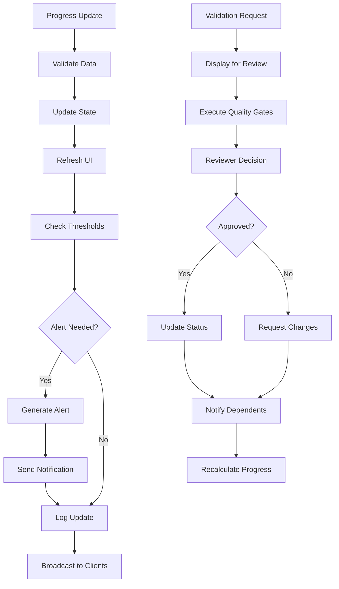

# Progress Tracking Service

**Status**: 📋 DRAFT | **Priority**: Medium | **Last Updated**: 2024-12-19
**Team**: AI Development | **Progress**: 0% | **Target Release**: Phase 1.4 - March 2025
**Dependencies**: 4 Blocking | 1 Related

## Status History

| Date       | Status   | Updated By       | Notes                                        |
| ---------- | -------- | ---------------- | -------------------------------------------- |
| 2024-12-19 | 📋 DRAFT | Solo Requirement | Initial PRD creation from main decomposition |

## 1. Product Overview

The Progress Tracking Service provides server-side progress calculation, metrics aggregation, and status monitoring for agile workflow execution, enabling MCP clients to retrieve real-time progress data and validation status.

This component serves as the backend service for progress monitoring, providing MCP tools for clients to access progress metrics, completion status, and workflow analytics.

## 2. Core Features

### 2.1 Service Roles

| Role            | Access Method        | Core Permissions                                          |
| --------------- | -------------------- | --------------------------------------------------------- |
| MCP Client      | MCP protocol connection | Access progress data, retrieve metrics, query status |
| AI Agent        | MCP tool execution   | Report progress, request validation, update task status |
| System Service  | Internal API         | Calculate metrics, aggregate data, trigger notifications |

### 2.2 Feature Module

Our Progress Tracking Service consists of:

1. **Progress Calculation Engine**: Real-time progress computation, completion percentage calculation, milestone tracking
2. **Dependency Analysis Service**: Dependency mapping, critical path calculation, bottleneck detection algorithms
3. **Execution Status Monitor**: AI agent activity tracking, task execution monitoring, error logging
4. **Validation Service**: Completion verification logic, quality gate evaluation, approval workflow management
5. **Metrics Aggregation Engine**: Performance metrics calculation, trend analysis, productivity analytics
6. **Notification Service**: Progress event triggers, blocker detection, milestone achievement notifications

### 2.3 Service Components

| Service Name                  | Component Name          | Feature description                                                         |
| ----------------------------- | ----------------------- | --------------------------------------------------------------------------- |
| Progress Calculation Engine   | Progress Calculator     | Calculate overall project progress, completion percentages, active work items |
| Progress Calculation Engine   | Milestone Tracker       | Track milestone achievements, deadline monitoring, critical path progress    |
| Progress Calculation Engine   | Status Aggregator       | Aggregate status updates, progress calculations, change event processing     |
| Dependency Analysis Service   | Graph Calculator        | Build dependency graphs, analyze relationships, detect cycles               |
| Dependency Analysis Service   | Critical Path Analyzer  | Calculate critical path, identify bottlenecks, impact analysis             |
| Dependency Analysis Service   | Relationship Mapper     | Map task relationships, hierarchy navigation, dependency resolution         |
| Execution Status Monitor      | Agent Activity Tracker  | Monitor active AI agents, current tasks, execution progress                |
| Execution Status Monitor      | Task Execution Logger   | Log individual task execution, performance tracking, status updates        |
| Execution Status Monitor      | Error Handler           | Process execution errors, failed validations, error resolution tracking    |
| Validation Service            | Completion Validator    | Validate completed work items against acceptance criteria                   |
| Validation Service            | Quality Gate Processor  | Process quality checkpoints, approval workflows, validation rule execution |
| Validation Service            | Approval Manager        | Manage pending approvals, approval history, delegation logic               |
| Metrics Aggregation Engine    | Performance Calculator  | Calculate productivity metrics, completion rates, velocity trends          |
| Metrics Aggregation Engine    | Trend Analyzer          | Analyze historical progress trends, predictive analytics, forecasting      |
| Metrics Aggregation Engine    | Agent Performance       | Track AI agent productivity, success rates, error analysis                |
| Notification Service          | Alert Generator         | Generate alerts, process notification rules, escalation logic             |
| Notification Service          | Event Processor         | Process notification events, alert history, acknowledgment tracking       |

## 3. Core Process

### Dashboard Initialization Flow

1. Load current project state from database
2. Calculate initial progress metrics and percentages
3. Generate dependency graph visualization
4. Initialize real-time update connections
5. Load user preferences and dashboard configuration
6. Start monitoring services for live updates
7. Display initial dashboard state

### Real-time Update Flow

1. Receive progress update from AI agent or system
2. Validate update data and permissions
3. Update internal state and calculations
4. Refresh affected dashboard components
5. Trigger notifications if thresholds met
6. Log update for audit and analytics
7. Broadcast updates to connected clients

### Validation and Approval Flow

1. AI agent completes work item and requests validation
2. Dashboard displays completion for review
3. Reviewer examines work against acceptance criteria
4. Quality gates and automated checks executed
5. Reviewer approves, rejects, or requests changes
6. Status updated and dependent items notified
7. Metrics updated and progress recalculated

### Alert and Escalation Flow

1. Monitor progress against defined thresholds
2. Detect issues, delays, or blockers
3. Generate appropriate alerts based on severity
4. Send notifications to relevant stakeholders
5. Track acknowledgment and response
6. Escalate unresolved issues according to rules
7. Log all alert activity for analysis



## 4. MCP Tools Specification

### 4.1 Progress Tracking Tools

* **get_progress**: Retrieve progress metrics for tasks, features, epics, or initiatives
* **get_completion_status**: Get detailed completion status with validation results
* **calculate_velocity**: Calculate team/agent velocity and productivity metrics
* **get_critical_path**: Analyze and return critical path dependencies
* **get_bottlenecks**: Identify current bottlenecks and blocking issues

### 4.2 Validation and Quality Tools

* **validate_task_completion**: Validate task completion against acceptance criteria
* **run_quality_gates**: Execute quality gate checks for work items
* **get_validation_status**: Retrieve validation results and approval status
* **approve_completion**: Mark work items as approved after validation
* **request_changes**: Request changes with specific feedback for work items

### 4.3 Metrics and Analytics Tools

* **get_performance_metrics**: Retrieve performance and productivity metrics
* **analyze_trends**: Get historical trend analysis and forecasting
* **get_agent_performance**: Analyze AI agent performance and success rates
* **generate_reports**: Generate progress and performance reports
* **export_metrics**: Export metrics data in various formats (JSON, CSV)

### 4.4 Notification and Alert Tools

* **configure_alerts**: Set up progress alerts and notification rules
* **get_notifications**: Retrieve pending notifications and alerts
* **acknowledge_alert**: Mark alerts as acknowledged
* **escalate_issue**: Escalate blocked or critical issues
* **subscribe_events**: Subscribe to progress events and status changes

## Architecture Considerations

### Referenced Architecture Documents

* **MCP\_SERVER\_CORE\_INFRASTRUCTURE\_PRD**: Server foundation and real-time capabilities - Status: 📋 DRAFT

* **AGILE\_WORKFLOW\_ENGINE\_PRD**: Progress calculation and workflow data - Status: 📋 DRAFT

* **TASK\_STORAGE\_SYNC\_SYSTEM\_PRD**: Data access for visualization - Status: 📋 DRAFT

* **MCP\_CLIENT\_TOOLS\_PRD**: Tool data for monitoring - Status: 📋 DRAFT

### Quality Attributes Alignment

| Attribute       | Strategy                                       | Architecture Doc Reference   |
| --------------- | ---------------------------------------------- | ---------------------------- |
| Scalability     | Efficient data aggregation, real-time updates  | TBD - Dashboard architecture |
| Performance     | Optimized rendering, lazy loading, caching     | TBD - Performance guidelines |
| Security        | Secure authentication, role-based access       | TBD - Security framework     |
| Reliability     | Graceful degradation, offline capabilities     | TBD - Reliability patterns   |
| Maintainability | Component-based architecture, clear separation | TBD - Code standards         |

### Architecture Validation Checkpoints

* [ ] Real-time updates perform efficiently with large datasets

* [ ] Dashboard components are modular and reusable

* [ ] Authentication and authorization properly implemented

* [ ] Performance meets responsiveness requirements

* [ ] Error handling provides meaningful user feedback

## Related PRDs

### Dependencies (Blocking)

* **MCP\_SERVER\_CORE\_INFRASTRUCTURE\_PRD**: Requires server and database foundation - Status: 📋 DRAFT

* **AGILE\_WORKFLOW\_ENGINE\_PRD**: Requires workflow data and progress calculation - Status: 📋 DRAFT

* **TASK\_STORAGE\_SYNC\_SYSTEM\_PRD**: Requires data access and search capabilities - Status: 📋 DRAFT

* **MCP\_CLIENT\_TOOLS\_PRD**: Requires tool data for comprehensive monitoring - Status: 📋 DRAFT

### Related (Non-blocking)

* **MCP\_JIVE\_AUTONOMOUS\_AI\_BUILDER\_PRD**: Parent PRD - Status: 📋 DRAFT

### Dependents (Blocked by this PRD)

* None (final component of Phase 1)

## Technical Requirements

### Frontend Technology Stack

* **Framework**: React 18+ with TypeScript

* **State Management**: Zustand or Redux Toolkit

* **UI Components**: Tailwind CSS with Headless UI

* **Charts**: Chart.js or D3.js for visualizations

* **Real-time**: WebSocket or Server-Sent Events

* **Build Tool**: Vite for fast development

### Backend API Requirements

```python
# Dashboard API Endpoints
@app.get("/api/dashboard/overview")
async def get_dashboard_overview() -> DashboardOverview:
    """Get overall dashboard data"""

@app.get("/api/dashboard/progress/{work_item_id}")
async def get_progress_data(work_item_id: str) -> ProgressData:
    """Get detailed progress for specific work item"""

@app.get("/api/dashboard/dependencies")
async def get_dependency_graph() -> DependencyGraph:
    """Get dependency graph data for visualization"""

@app.get("/api/dashboard/agents")
async def get_agent_status() -> List[AgentStatus]:
    """Get current AI agent status and activity"""

@app.websocket("/ws/dashboard")
async def dashboard_websocket(websocket: WebSocket):
    """WebSocket for real-time dashboard updates"""
```

### Data Models

```typescript
interface DashboardOverview {
  totalWorkItems: number;
  completedWorkItems: number;
  inProgressWorkItems: number;
  blockedWorkItems: number;
  overallProgress: number;
  activeAgents: number;
  recentActivity: ActivityItem[];
}

interface ProgressData {
  workItemId: string;
  title: string;
  type: WorkItemType;
  status: WorkItemStatus;
  progress: number;
  children: ProgressData[];
  dependencies: string[];
  estimatedCompletion: Date;
}

interface AgentStatus {
  agentId: string;
  name: string;
  status: 'active' | 'idle' | 'error';
  currentTask?: string;
  tasksCompleted: number;
  lastActivity: Date;
}
```

### Real-time Update System

```python
class DashboardUpdateManager:
    async def broadcast_progress_update(self, work_item_id: str, progress_data: ProgressData)
    async def broadcast_agent_status(self, agent_id: str, status: AgentStatus)
    async def broadcast_validation_request(self, work_item_id: str, validation_data: ValidationRequest)
    async def broadcast_alert(self, alert: Alert, recipients: List[str])
```

### Performance Requirements

* Initial dashboard load: <2 seconds

* Real-time update latency: <100ms

* Chart rendering: <500ms for complex visualizations

* Search and filter response: <200ms

* Concurrent user support: 20+ simultaneous users

### Accessibility Requirements

* WCAG 2.1 AA compliance

* Keyboard navigation support

* Screen reader compatibility

* High contrast mode support

* Responsive design for all devices

### Security Requirements

* Role-based access control

* Secure WebSocket connections

* Input validation and sanitization

* CSRF protection

* Audit logging for all user actions

