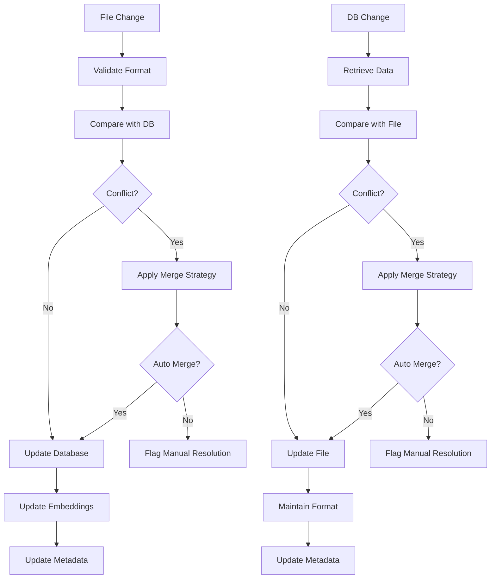

# Task Storage and Sync System

**Status**: 📋 DRAFT | **Priority**: High | **Last Updated**: 2024-12-19
**Team**: AI Development | **Progress**: 0% | **Target Release**: Phase 1.2 - February 2025
**Dependencies**: 1 Blocking | 2 Related

## Status History

| Date       | Status   | Updated By       | Notes                                        |
| ---------- | -------- | ---------------- | -------------------------------------------- |
| 2024-12-19 | 📋 DRAFT | Solo Requirement | Initial PRD creation from main decomposition |

## 1. Product Overview

The Task Storage and Sync System provides bidirectional synchronization between local file system storage (.jivedev/tasks/\*) and the Weaviate vector database, enabling git-committable task definitions while maintaining powerful search and relationship capabilities.

This component ensures that agile work items can be version controlled, shared across teams, and synchronized with the vector database for AI agent access and semantic search.

**Critical Architectural Constraint**: The MCP Server **NEVER** directly accesses local file systems. All file operations (reading, writing, monitoring) are performed by the MCP Client and communicated to the server through the MCP protocol. The server only manages the database synchronization and vector search capabilities.

## 2. Core Features

### 2.1 User Roles

| Role                 | Registration Method   | Core Permissions                           |
| -------------------- | --------------------- | ------------------------------------------ |
| Developer            | File system access    | Read/write local task files, commit to git |
| AI Agent             | MCP Client connection | Read task data, trigger sync operations    |
| System Administrator | Configuration access  | Configure sync settings, resolve conflicts |

### 2.2 Feature Module

Our Task Storage and Sync System consists of:

1. **Local File Manager**: .jivedev/tasks/\* folder structure, JSON/YAML file operations
2. **Database Sync Engine**: Bidirectional synchronization, conflict resolution, change detection
3. **Vector Search Interface**: Semantic search, keyword search, relationship queries
4. **File Format Handler**: JSON/YAML serialization, schema validation, migration support
5. **Conflict Resolution**: Merge strategies, version tracking, manual resolution workflows
6. **Change Detection**: File system monitoring, database change tracking, sync triggers

### 2.3 Page Details

| Page Name               | Module Name          | Feature description                                                        |
| ----------------------- | -------------------- | -------------------------------------------------------------------------- |
| **MCP Client File Ops** | **Directory Structure** | **MCP Client creates and maintains .jivedev/tasks/ hierarchy matching work item structure** |
| **MCP Client File Ops** | **File Operations**     | **MCP Client reads, writes, deletes task definition files in JSON/YAML format** |
| **MCP Client File Ops** | **Schema Validation**   | **MCP Client validates file format, ensures required fields, checks data integrity** |
| Database Sync Engine    | Sync Orchestrator    | Coordinate bidirectional sync between MCP Client file data and Weaviate database |
| Database Sync Engine    | Change Detection     | Process file system changes reported by MCP Client, track database modifications |
| Database Sync Engine    | Sync Execution       | Execute sync operations, handle batch updates, maintain consistency        |
| Vector Search Interface | Semantic Search      | Perform vector-based similarity search across task descriptions            |
| Vector Search Interface | Keyword Search       | Execute text-based search with filtering and ranking                       |
| Vector Search Interface | Relationship Queries | Query task relationships, dependencies, hierarchy navigation               |
| File Format Handler     | JSON Serialization   | Convert work items from MCP Client to/from JSON format with proper schema |
| File Format Handler     | YAML Support         | Support YAML format for human-readable task definitions from MCP Client   |
| File Format Handler     | Schema Migration     | Handle format changes, migrate existing MCP Client files to new schemas   |
| Conflict Resolution     | Conflict Detection   | Identify conflicts between MCP Client file and database versions          |
| Conflict Resolution     | Merge Strategies     | Implement automatic merge strategies for common conflicts                  |
| Conflict Resolution     | Manual Resolution    | Provide tools for manual conflict resolution when needed                   |
| Change Detection        | Event Processor      | Process file system events reported by MCP Client for .jivedev/tasks/ directory |
| Change Detection        | Database Monitor     | Track changes in Weaviate database, detect external modifications          |
| Change Detection        | Sync Triggers        | Trigger sync operations based on MCP Client change detection               |

## 3. Core Process

### Initial Sync Setup Flow

1. Scan existing .jivedev/tasks/ directory structure
2. Validate all task definition files
3. Import valid files into Weaviate database
4. Generate vector embeddings for task descriptions
5. Establish baseline sync state
6. Start change monitoring services
7. Report sync status and any conflicts

### File-to-Database Sync Flow

1. File system change detected in .jivedev/tasks/
2. Validate changed file format and schema
3. Compare with existing database version
4. Detect conflicts if database was modified
5. Apply automatic merge strategy or flag for manual resolution
6. Update database with merged changes
7. Generate new vector embeddings if content changed
8. Update sync metadata and timestamps

### Database-to-File Sync Flow

1. Database change detected in Weaviate
2. Retrieve updated work item data
3. Compare with existing file version
4. Detect conflicts if file was modified
5. Apply merge strategy or flag for resolution
6. Write updated data to file system
7. Maintain file format and structure
8. Update sync metadata

### Search and Retrieval Flow

1. Receive search query from AI agent or user
2. Determine search type (semantic, keyword, relationship)
3. Execute appropriate search against Weaviate
4. Rank and filter results based on relevance
5. Return structured results with metadata
6. Log search metrics for optimization



## 4. MCP Storage and Sync API

### 4.1 Storage & Sync Tools (3 tools)

* **sync_file_to_database**: Sync local task metadata to vector database
* **sync_database_to_file**: Sync database changes to local task files
* **get_sync_status**: Check synchronization status of task metadata

### 4.2 Data Synchronization Protocols

**Sync Status Indicators:**
```json
{
  "sync_status": {
    "in_sync": "File and database are synchronized",
    "file_newer": "Local file has newer changes",
    "db_newer": "Database has newer changes",
    "conflict": "Both file and database modified",
    "error": "Synchronization error occurred"
  }
}
```

**Conflict Resolution Strategies:**
* `auto_merge` - Automatic merge for non-conflicting changes
* `file_wins` - Prioritize local file changes
* `database_wins` - Prioritize database changes
* `manual_resolution` - Flag for manual intervention
* `create_branch` - Create separate versions for resolution

### 4.3 Search and Query Interface

**Search Query Format:**
```json
{
  "query": "string",
  "search_type": "semantic|keyword|hybrid",
  "filters": {
    "type": ["epic", "feature", "story", "task"],
    "status": ["not_started", "in_progress", "completed"],
    "priority": ["low", "medium", "high", "critical"]
  },
  "limit": 50,
  "include_metadata": true
}
```

**Search Result Format:**
```json
{
  "results": [
    {
      "id": "string",
      "title": "string",
      "type": "string",
      "relevance_score": 0.95,
      "sync_status": "in_sync",
      "last_modified": "datetime",
      "file_path": "string"
    }
  ],
  "total_count": 42,
  "search_time_ms": 15
}
```

## Architecture Considerations

### Referenced Architecture Documents

* **MCP\_SERVER\_CORE\_INFRASTRUCTURE\_PRD**: Database foundation and configuration - Status: 📋 DRAFT

* Will create data synchronization architecture patterns

### Quality Attributes Alignment

| Attribute       | Strategy                                      | Architecture Doc Reference   |
| --------------- | --------------------------------------------- | ---------------------------- |
| Scalability     | Efficient sync algorithms, batch processing   | TBD - Sync patterns          |
| Performance     | Incremental sync, optimized vector operations | TBD - Performance guidelines |
| Security        | Secure file operations, data validation       | TBD - Security framework     |
| Reliability     | Conflict resolution, data integrity checks    | TBD - Reliability patterns   |
| Maintainability | Clear separation of sync and storage concerns | TBD - Code standards         |

### Architecture Validation Checkpoints

* [ ] File format supports all work item types and relationships

* [ ] Sync engine handles concurrent modifications safely

* [ ] Conflict resolution covers all common scenarios

* [ ] Vector search performance scales with data size

* [ ] Data integrity maintained across sync operations

## Related PRDs

### Dependencies (Blocking)

* **MCP\_SERVER\_CORE\_INFRASTRUCTURE\_PRD**: Requires Weaviate database setup - Status: 📋 DRAFT

### Related (Non-blocking)

* **MCP\_JIVE\_AUTONOMOUS\_AI\_BUILDER\_PRD**: Parent PRD - Status: 📋 DRAFT

* **AGILE\_WORKFLOW\_ENGINE\_PRD**: Provides work item data model - Status: 📋 DRAFT

### Dependents (Blocked by this PRD)

* **MCP\_CLIENT\_TOOLS\_PRD**: Requires search and storage capabilities - Status: Planned

## Technical Requirements

### File Structure

```
.jivedev/
├── tasks/
│   ├── initiatives/
│   │   └── {initiative-id}.json
│   ├── epics/
│   │   └── {epic-id}.json
│   ├── features/
│   │   └── {feature-id}.json
│   ├── stories/
│   │   └── {story-id}.json
│   ├── tasks/
│   │   └── {task-id}.json
│   ├── relationships.json
│   └── metadata.json
├── sync/
│   ├── sync-state.json
│   ├── conflicts/
│   └── backups/
└── config/
    └── sync-config.json
```

### File Format Schema

```json
{
  "id": "epic-001",
  "type": "epic",
  "title": "User Authentication System",
  "description": "Implement secure user authentication...",
  "status": "in_progress",
  "priority": "high",
  "effort_estimate": 40,
  "acceptance_criteria": [
    "Users can register with email",
    "Password reset functionality works"
  ],
  "parent_id": "initiative-001",
  "children_ids": ["feature-001", "feature-002"],
  "dependencies": ["epic-002"],
  "metadata": {
    "created_at": "2024-12-19T10:00:00Z",
    "updated_at": "2024-12-19T15:30:00Z",
    "created_by": "ai-agent-001",
    "last_synced": "2024-12-19T15:30:00Z",
    "file_version": "1.0",
    "checksum": "abc123..."
  }
}
```

### Core Dependencies

* **File Monitoring**: watchdog for file system monitoring

* **Serialization**: pydantic for data validation, PyYAML for YAML support

* **Vector Operations**: Weaviate Python client

* **Conflict Resolution**: diff libraries, merge algorithms

* **Async Operations**: asyncio for concurrent sync operations

### Sync Engine Classes

```python
class SyncEngine:
    async def sync_file_to_database(self, file_path: str) -> SyncResult
    async def sync_database_to_file(self, work_item_id: str) -> SyncResult
    async def detect_conflicts(self, work_item_id: str) -> List[Conflict]
    async def resolve_conflict(self, conflict: Conflict, strategy: MergeStrategy) -> Resolution

class FileManager:
    def read_work_item(self, file_path: str) -> WorkItem
    def write_work_item(self, work_item: WorkItem, file_path: str) -> bool
    def validate_file_format(self, file_path: str) -> ValidationResult
    def get_file_checksum(self, file_path: str) -> str
```

### Performance Requirements

* File sync operation: <500ms per file

* Batch sync: <5 seconds for 100 files

* Search response time: <100ms for semantic search

* Conflict detection: <200ms per work item

* File system monitoring: <10ms change detection latency

### Data Integrity Requirements

* Checksum validation for all file operations

* Atomic sync operations with rollback capability

* Backup creation before destructive operations

* Validation of all data before database updates

* Audit trail for all sync operations

