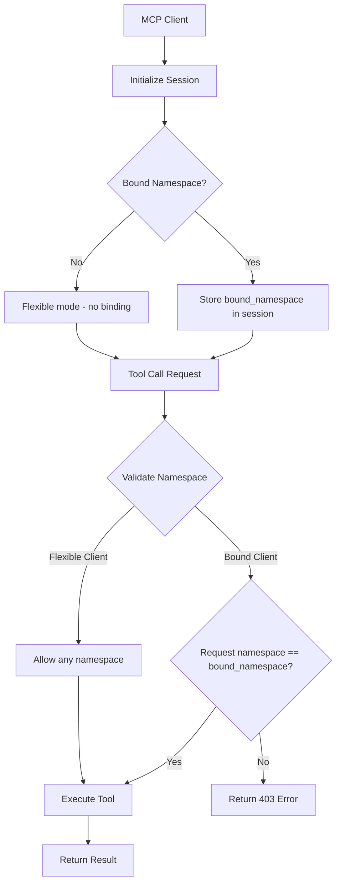

# MCP Client Namespace Binding

**Status**: ✅ COMPLETED | **Priority**: High | **Last Updated**: 2025-01-23
**Implementation**: Complete | **Testing**: 100% Pass Rate | **Documentation**: Complete

## Overview

The MCP (Model Context Protocol) Client Namespace Binding feature provides secure namespace isolation for MCP clients, ensuring that clients can only access data within their designated namespaces. This feature supports both bound clients (restricted to specific namespaces) and flexible clients (can access any namespace).

## Key Features

### 🔒 Namespace Security
- **Bound Clients**: Restricted to a specific namespace during session initialization
- **Flexible Clients**: Can access any namespace (for administrative use)
- **Automatic Enforcement**: Server-side validation prevents unauthorized namespace access
- **Session Isolation**: Each client session maintains its own namespace binding

### 🌐 Protocol Support
- **HTTP MCP Endpoint**: `/mcp` with JSON-RPC over HTTP
- **WebSocket MCP Endpoint**: `/mcp` with real-time WebSocket communication
- **Frontend API Routes**: Next.js API routes with namespace header forwarding
- **Backend Tools API**: Direct `/tools/execute` endpoint with namespace support

### 🔄 Client Types
1. **Bound Clients**: Locked to specific namespace during initialization
2. **Flexible Clients**: Can specify namespace per request
3. **Web App Clients**: Frontend applications using API routes

## Architecture

### Namespace Binding Flow



### Session Management

```python
# Session structure for bound clients
session = {
    "session_id": "uuid-string",
    "bound_namespace": "client-specific-namespace",
    "client_type": "bound",
    "created_at": "timestamp"
}

# Session structure for flexible clients
session = {
    "session_id": "uuid-string", 
    "bound_namespace": None,
    "client_type": "flexible",
    "created_at": "timestamp"
}
```

## Implementation Details

### 1. Client Initialization

#### Bound Client Initialization
```json
{
  "jsonrpc": "2.0",
  "id": 1,
  "method": "initialize",
  "params": {
    "protocolVersion": "2024-11-05",
    "capabilities": {},
    "clientInfo": {
      "name": "bound-client",
      "version": "1.0.0",
      "bound_namespace": "my-specific-namespace"
    }
  }
}
```

#### Flexible Client Initialization
```json
{
  "jsonrpc": "2.0",
  "id": 1,
  "method": "initialize", 
  "params": {
    "protocolVersion": "2024-11-05",
    "capabilities": {},
    "clientInfo": {
      "name": "flexible-client",
      "version": "1.0.0"
    }
  }
}
```

### 2. Tool Execution

#### Bound Client Tool Call
```json
{
  "jsonrpc": "2.0",
  "id": 2,
  "method": "tools/call",
  "params": {
    "name": "jive_search_content",
    "arguments": {
      "query": "search term",
      "_meta": {
        "namespace": "my-specific-namespace"
      }
    }
  }
}
```

#### Flexible Client Tool Call
```json
{
  "jsonrpc": "2.0",
  "id": 2,
  "method": "tools/call",
  "params": {
    "name": "jive_search_content", 
    "arguments": {
      "query": "search term",
      "_meta": {
        "namespace": "any-namespace"
      }
    }
  }
}
```

### 3. Error Responses

#### Namespace Access Denied (HTTP)
```json
{
  "jsonrpc": "2.0",
  "id": 2,
  "error": {
    "code": -32603,
    "message": "Namespace access denied. Client is bound to namespace 'bound-ns' but requested 'wrong-ns'"
  }
}
```

#### Namespace Access Denied (WebSocket)
```json
{
  "jsonrpc": "2.0",
  "id": 2,
  "error": {
    "code": -32000,
    "message": "Namespace access denied. Client is bound to namespace 'bound-ns' but requested 'wrong-ns'"
  }
}
```

## Server Configuration

### Environment Variables
```bash
# MCP Server Configuration
MCP_SERVER_HOST=localhost
MCP_SERVER_PORT=3454
MCP_SERVER_MODE=combined  # Supports both HTTP and WebSocket

# Database Configuration
LANCEDB_PATH=./data/lancedb
WORK_ITEMS_DB_PATH=./data/work_items.db

# Security Configuration
CORS_ENABLED=true
NAMESPACE_ISOLATION_ENABLED=true
```

### Server Startup
```bash
# Start MCP server with namespace binding support
./bin/mcp-jive server start --mode combined --host localhost --port 3454
```

## Frontend Integration

### Next.js API Route Example
```typescript
// frontend/src/app/api/mcp/jive_search_content/route.ts
import { NextRequest, NextResponse } from 'next/server';

const MCP_SERVER_URL = process.env.MCP_SERVER_URL || 'http://localhost:3454';

export async function POST(request: NextRequest) {
  const body = await request.json();
  const namespace = request.headers.get('X-Namespace');
  
  const headers: Record<string, string> = {
    'Content-Type': 'application/json',
  };
  
  // Forward X-Namespace header if present
  if (namespace) {
    headers['X-Namespace'] = namespace;
  }
  
  const response = await fetch(`${MCP_SERVER_URL}/tools/execute`, {
    method: 'POST',
    headers,
    body: JSON.stringify({
      tool_name: 'jive_search_content',
      parameters: body.parameters || body
    })
  });
  
  return NextResponse.json(await response.json());
}
```

### Frontend Client Usage
```javascript
// Frontend API call with namespace
const response = await fetch('/api/mcp/jive_search_content', {
  method: 'POST',
  headers: {
    'Content-Type': 'application/json',
    'X-Namespace': 'user-specific-namespace'
  },
  body: JSON.stringify({
    query: 'search term',
    limit: 10
  })
});
```

## Security Considerations

### 1. Namespace Isolation
- **Data Separation**: Each namespace maintains completely isolated data
- **Access Control**: Bound clients cannot access other namespaces
- **Session Security**: Namespace binding persists for entire session lifecycle

### 2. Authentication Integration
```python
# Example: Integrate with authentication system
def get_user_namespace(auth_token):
    """Extract user's namespace from authentication token"""
    user = authenticate_token(auth_token)
    return f"user-{user.id}"

# Client initialization with auth-derived namespace
client_info = {
    "name": "authenticated-client",
    "version": "1.0.0", 
    "bound_namespace": get_user_namespace(request.headers.get('Authorization'))
}
```

### 3. Audit Logging
```python
# Namespace access logging
logger.info(f"Client {session_id} accessed namespace {namespace} for tool {tool_name}")
logger.warning(f"Client {session_id} denied access to namespace {requested_ns} (bound to {bound_ns})")
```

## Performance Considerations

### 1. Session Management
- **Memory Efficient**: Sessions stored in lightweight dictionary structure
- **Cleanup**: Automatic session cleanup on disconnect
- **Scalability**: Supports thousands of concurrent sessions

### 2. Database Isolation
- **Efficient Queries**: Namespace filtering at database level
- **Index Optimization**: Namespace-aware database indexes
- **Connection Pooling**: Shared database connections across namespaces

### 3. Caching Strategy
```python
# Namespace-aware caching
cache_key = f"namespace:{namespace}:tool:{tool_name}:params:{hash(params)}"
cached_result = cache.get(cache_key)
if cached_result:
    return cached_result
```

## Testing

### Test Coverage
- ✅ **Frontend API Routes**: Namespace header forwarding
- ✅ **Backend Tools API**: Direct namespace handling  
- ✅ **HTTP MCP Client**: Bound and flexible client scenarios
- ✅ **WebSocket MCP Client**: Real-time namespace enforcement
- ✅ **Error Handling**: Proper rejection of unauthorized access
- ✅ **Session Management**: Initialization and cleanup

### Test Results
```
🧪 PROTOCOL NAMESPACE ISOLATION TEST SUMMARY
============================================================
Total Tests: 10
Passed: 10
Failed: 0
Success Rate: 100.0%
============================================================
```

### Running Tests
```bash
# Run comprehensive namespace isolation tests
python test_protocol_namespace_isolation.py

# Run database-level isolation tests  
python test_namespace_isolation.py
```

## Troubleshooting

### Common Issues

#### 1. Namespace Access Denied
**Problem**: Client receives 403 error when making tool calls
**Solution**: Verify client is using correct namespace or initialize as flexible client

#### 2. Session Not Found
**Problem**: Client receives session not found error
**Solution**: Ensure client properly initializes session before making tool calls

#### 3. Frontend API 404 Errors
**Problem**: Frontend API routes return 404
**Solution**: Verify frontend server is running and API routes are properly configured

### Debug Commands
```bash
# Check server logs
tail -f logs/mcp-server.log

# Test namespace isolation
curl -X POST http://localhost:3454/tools/execute \
  -H "X-Namespace: test-namespace" \
  -d '{"tool_name": "jive_search_content", "parameters": {"query": "test"}}'

# Test MCP client initialization
curl -X POST http://localhost:3454/mcp \
  -H "Content-Type: application/json" \
  -d '{"jsonrpc": "2.0", "id": 1, "method": "initialize", "params": {"protocolVersion": "2024-11-05", "clientInfo": {"name": "test", "bound_namespace": "test-ns"}}}'
```

## Migration Guide

### Upgrading Existing Clients

#### Before (No Namespace Binding)
```json
{
  "jsonrpc": "2.0",
  "id": 1,
  "method": "initialize",
  "params": {
    "protocolVersion": "2024-11-05",
    "clientInfo": {"name": "client", "version": "1.0.0"}
  }
}
```

#### After (With Namespace Binding)
```json
{
  "jsonrpc": "2.0", 
  "id": 1,
  "method": "initialize",
  "params": {
    "protocolVersion": "2024-11-05",
    "clientInfo": {
      "name": "client",
      "version": "1.0.0",
      "bound_namespace": "client-specific-namespace"
    }
  }
}
```

### Backward Compatibility
- **Existing Clients**: Continue to work as flexible clients
- **No Breaking Changes**: All existing functionality preserved
- **Gradual Migration**: Clients can adopt namespace binding incrementally

## Best Practices

### 1. Namespace Design
- **Hierarchical**: Use hierarchical namespace structure (`org.team.project`)
- **Descriptive**: Choose meaningful namespace names
- **Consistent**: Maintain consistent naming conventions

### 2. Client Implementation
- **Error Handling**: Implement proper error handling for namespace rejections
- **Retry Logic**: Add retry logic for transient failures
- **Logging**: Log namespace-related operations for debugging

### 3. Security
- **Principle of Least Privilege**: Use bound clients whenever possible
- **Regular Audits**: Monitor namespace access patterns
- **Authentication Integration**: Tie namespaces to user authentication

## Related Documentation

- [MCP Protocol Specification](https://spec.modelcontextprotocol.io/)
- [Jive Work Item Management](./work-item-management.md)
- [Database Architecture](./database-architecture.md)
- [API Reference](./api-reference.md)

## Changelog

### v1.0.0 (2025-01-23)
- ✅ Initial implementation of namespace binding
- ✅ HTTP and WebSocket MCP endpoint support
- ✅ Frontend API route integration
- ✅ Comprehensive testing suite
- ✅ Complete documentation

---

*This document provides comprehensive coverage of the MCP Client Namespace Binding feature. For additional support or questions, please refer to the troubleshooting section or contact the development team.*